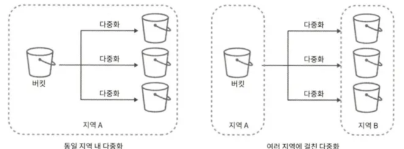
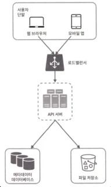
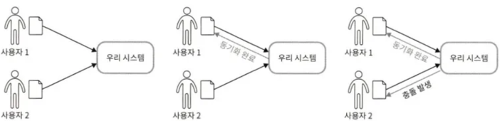
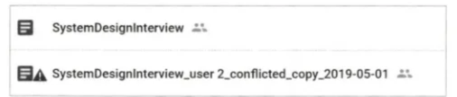
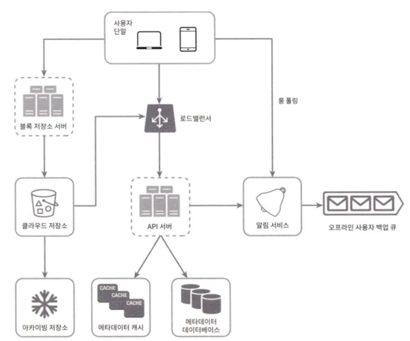
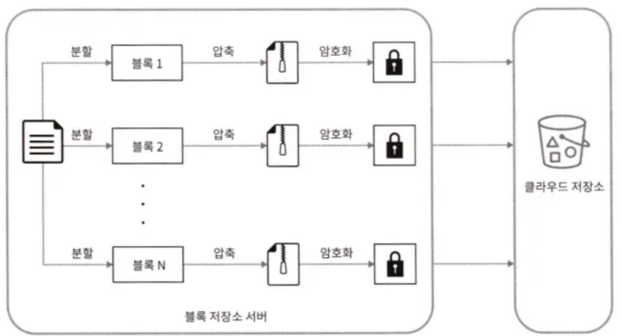
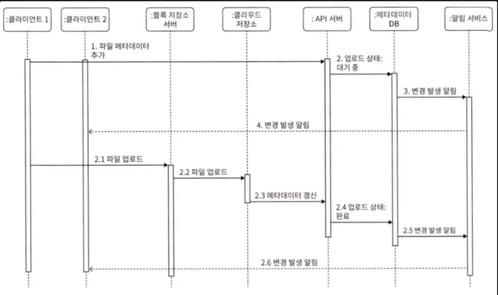
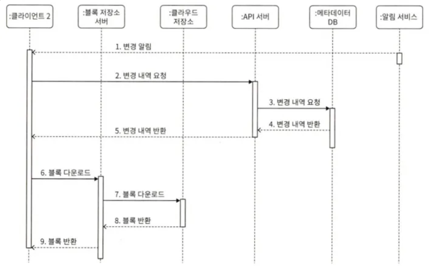

구글 드라이브, 드롭박스, 마이크로소프트 원드라이브, 애플 아이클라우드 등의 클라우드 저장소 서비스를 설계해 보자

구글 드라이브는 파일 저장 및 동기화 서비스로, 문서, 사진, 비디오, 디타 파일을 클라우드에 보관할 수 있도록 한다. 이 파일은 컴퓨터, 스마트폰, 태블릿 등 어떤 단말에서도 이용 가능해야 한다.

아울러 보관된 파일은 친구, 가족, 동료들과 손쉽게 공유할 수 있어야 한다.

## 1단계: 문제 이해 및 설계 범위 확정

> 지원자: 가장 중요한 기능은 무엇인가요?
> 
> 
> 면접관: 파일 업로드/다운로드, 파일 동기화, 그리고 알림입니다.
> 
> **지원자: 모바일 앱이나 웹 앱 가운데 하나만 지원하면 되나요? 아니면 둘 다 지원해야 하나요?**
> 
> 면접관: 둘 다 지원해야 합니다.
> 
> **지원자: 파일을 암호화해야 할까요?**
> 
> 면접관: 네.
> 
> **지원자: 파일 크기에 제한이 있나요?**
> 
> 면접관: 10GB 제한이 있습니다.
> 
> **지원자: 사용자는 얼마나 되나요?**
> 
> 면접관: DAU 기준으로 천만 명입니다.
> 

### 기능 설계

- 파일 추가
- 여러 단말에 파일 동기화
- 파일 갱신 이력 조회
- 파일 공유
- 파일이 편집되거나 삭제되거나 새롭게 공유되었을 때 알림 표시

### 비기능적 요구사항

- 안정성: 저장소 시스템에서 안정성은 아주 중요하다. 데이터 손실이 발생하면 안된다.
- 빠른 동기화 속도: 파일 동기화에 시간이 너무 많이 걸리면 안된다.
- 네트워크 대역폭: 네트워크 대역폭을 불필요하게 많이 소모하면 좋지 않다. 모바일 데이터 플랜을 사용하는 경우라면 더욱 그렇다.
- 규모 확장성: 이 시스템은 아주 많은 양의 트래픽도 처리 가능해야 한다.
- 높은 가용성: 일부 서버에 장애가 발생하거나, 느려지거나, 네트워크 일부가 끊겨도 시스템은 계속 사용 가능해야 한다.

### 개략적 추정치

- 가입자: 5천만 명, DAU: 천만 명
- 모든 사용자에게 10GB 무료 저장공간 할당
- 매일 각 사용자가 평균 2개의 파일을 업로드한다고 가정. 각 파일의 평균 크기는 500KB
- 읽기:쓰기 비율은 1:1
- 필요한 저장공간 총량 = 5천만 사용자 x 10GB = 500PB
- 업로드 API QPS = 1천만 사용자 x 2회 업로드 / 24시간 / 3600초 = 약 240
- 최대 QPS = QPS x 2 = 480

## 2단계: 개략적 설계안 제시 및 동의 구하기

지금까지 다이어그램을 제시했던 것과는 달리 이번에는 모든 것을 한 대 서버에서 출발해 점진적으로 발전시켜 보겠다.

우선은 아래와 같은 구성의 서버 한 대로 시작해 보자.

- 파일을 올리고 다운로드하는 과정을 처리할 웹 서버
- 사용자 데이터, 로그인 정보, 파일 정보 등의 메타데이터를 보관할 데이터베이스
- 파일을 저장할 저장소 시스템

### API

### 1. 파일 업로드 API

- 단순 업로드: 파일 크기가 작을 때 사용
- 이어 올리기: 파일 사이즈가 크고, 네트워크 문제로 업로드가 중단될 가능성이 높을 때 사용

이어 올리기 API의 예) `https://api.example.com/files/upload?uploadType=resumable`

- uploadType=resumable
- data: 업로드할 로컬 파일

이어 올리기는 다음 세 단계 절차로 이루어진다.

- 이어올리기 URL을 받디 위한 최초 요청 전송
- 데이터를 업로드하고 업로드 상태 모니터링
- 업로드에 장애가 발생하면 장애 발생 시점부터 업로드 재시작

### 2. 파일 다운로드 API

예)

```
https://api.example.com/files/download

body: { "path": "/recipes/soup/best_soup.txt" }
```

- path: 다운로드할 파일의 경로

### 3. 파일 갱신 히스토리 API

예)

```
https://api.example.com/files/list_revisions

body: {
		"path": "/recipes/soup/best_soup.txt",
		"limit": 20
	  }
```

- path: 갱신 히스토리를 가져올 파일의 경로
- limit: 히스토리 길이의 최대치

### 한 대 서버의 제약 극복

업로드되는 파일이 많아 지다 보면 결국에는 파일 시스템이 가득차게 된다.

이때 가장 먼저 떠오르는 해결책은 데이터를 **샤딩하여** 여러 서버에 나누어 저장하는 것이다.

하지만 샤딩을 한다고 해도 서버에 장애가 생기면 데이터를 잃게 될 위험이 있다.

이를 위해 아마존 S3를 사용하는 것이 좋다. S3는 뛰어난 규모 확장성, 가용성, 보안, 성능을 제공하는 객체 저장소 서비스이다.

또한 S3는 다중화를 지원하는데, 같은 지역 안에서 다중화 할 수도 있고, 여러 지역에 걸쳐 다중화를 할 수도 있다.



> 디스크 저장 공간이 얼마남지 않아, 데이터를 샤딩하여 여러 서버에 나누어 저장하는 것이다.
→ 서버 장애시, 데이터 소실 우려로 저장소인 AWS S3를 사용하는 것이다.
S3는 다중화를 지원하며, S3 버킷은 파일시스템의 폴더와도 같은 것이라고 생각하면 이해하기 쉽다.
> 

이 밖에 미래에 발생할 문제를 막기위해 개선할 부분을 찾아보자



- ***로드밸런서***: 네트워크 트래픽을 분산하기 위해 로드밸런서를 사용한다. 
로드밸런서는 트래픽을 고르게 분산할 수 있을 뿐 아니라, 특정 웹 서버에 장애가 발생하면 자동으로 해당 서버를 우회해준다.
- 웹 서버: 로드밸런서를 추가하고 나면 더 많은 웹 서버를 손쉽게 추가할 수 있다. 즉, 트래픽 폭증에 쉽게 대응이 가능하다.
- 메타데이터 데이터베이스: 데이터베이스를 파일 저장 서버에서 분리하여 SPOF를 회피한다. 아울러 다중화 및 샤딩 정책을 적용하여 가용성과 규모 확장성 요구사항에 대응한다.
- 파일 저장소: S3를 파일 저장소로 사용하고 가용성과 데이터 무손실을 보장하기 위해 두 개 이상의 지역에 데이터를 다중화한다.

### 동기화 충돌



두 명 이상의 사용자가 같은 파일이나 폴더를 동시에 업데이트하려고 할 때 동기화 충돌이 발생할 수 있다.

위 그림에서 사용자 1과 2는 같은 파일을 동시에 갱신하려 한다. 하지만 이 시스템은 사용자 1의 파일을 먼저 처리했다. 따라서 사용자 1의 파일 갱신 시도는 정상적으로 처리되지만 사용자 2에 대해서는 동기화 충돌 오류가 발생할 것이다.



이를 해결하기 위해서 오류가 발생한 시점에 파일을 복사하여 두 버전을 유지한다. 즉, 사용자 2가 가지고 있는 로컬 사본과 서버에 있는 최신 버전 두 파일이 존재하게 된다.

이 상태에서 사용자는 두 파일을 하나로 합칠지 아니면 둘 중 하나를 다른 파일로 대체할지를 결정해야 한다.

### 개략적 설계안



- 사용자 단말: 사용자가 이용하는 웹브라우저나 모바일 앱 등의 클라이언트
- 블록 저장소 서버: 파일 블록을 클라우드 저장소에 업로드하는 서버이다. 클라우드 환경에서 데이터 파일을 저장하는 기술로, 파일을 여러 개의 블록으로 나눠 저장하며, 각 블록에는 고유한 해시값이 할당된다. 이 해시값은 메터데이터 데이터베이스에 저장된다. 각 블록은 독립적인 객체로 취급되며 클라우드 저장소 시스템(S3)에 보관된다. 파일을 재구성하려면 블록들을 원래 순서대로 합쳐야 한다.
- 클라우드 저장소: 파일은 블록 단위로 나눠져 클라우드 저장소에 보관된다.
- 아카이빙 저장소: 오랫동안 사용되지 않은 비활성 데이터를 저장하기 위한 시스템이다.
- 로드밸런서: 요청을 API 서버에 고르게 분산하는 역할
- 메타데이터 데이터베이스: 사용자, 파일, 블록, 버전 등의 메타데이터 정보를 관리한다. 실제 파일은 클라우드에 보관하며, 이 데이터베이스는 오직 메타데이터만 다룬다.
- 메타데이터 캐시: 자주 쓰이는 메타데이터를 캐시한다.
- 알림 서비스: 특정 이벤트가 발생했음을 클라이언트에게 알리는 발생/구독 프로토콜 기반 시스템
- 오프라인 사용자 백업 큐: 클라이언트가 접속중이 아니라서 파일의 최신 상태를 확인할 수 없을 때는 해당 정보를 이 큐에 두어 나중에 클라이언트가 접속했을 때 동기화될 수 있도록 한다.

## 3단계: 상세 설계

### 블록 저장소 서버

이 시스템에서 블록 저장소 서버는 ①클라이언트가 보낸 파일을 블록 단위로 나눠야 하고, ②각 블록에 압축 알고리즘을 적용해야 하고, ③암호화까지 해야 한다. ④아울러 전체 파일을 저장소 시스템으로 보내는 대신 수정된 블록만 전송해야 한다.



정기적으로 갱신되는 큰 파일들을 업데이트가 일어날 때마다 전체 파일을 서버로 보내면 네트워크 대역폭을 많이 잡아먹게 된다.

이를 최적화하는 방법으로는 두 가지 정도를 생각해 볼 수 있다.

- 델타 동기화: 파일이 수정되면 전체 파일 대신 수정이 일어난 블록만 동기화한다.
- 압축: 블록 단위로 압축해 두면 데이터 크기를 많이 줄일 수 있다. 압축 알고리즘은 파일 유형에 따라 정한다.


검정색으로 표시된 블록이 수정된 블록이라고 할 때, 갱신된 부분만 동기화해야 하므로 이 두 블록만 클라우드 저장소에 업로드하면 된다.

### 높은 일관성 요구사항

이 시스템은 강한 일관성 모델을 기본으로 지원해야 한다. 즉, 같은 파일이 단말이나 사용자에 따라 다르게 보이는 것을 허용할 수 없다는 뜻이다.

이 원칙은 메타데이터 캐시와 데이터베이스 계층에도 동일하게 적용되어야 한다.

메모리 캐시는 보통 결과적 일관성 모델을 지원한다. 따라서 강한 일관성을 달성하려면 다음 사항을 보장해야 한다.

- 캐시에 보관된 사본과 데이터베이스에 있는 원본이 일치한다.
- 데이터베이스에 보관된 원본에 변경이 발생하면 캐시에 있는 사본을 무효화한다.

관계형 데이터베이스는 ACID를 보장하므로 강한 일관성을 보장하기 쉽다. 하지만 NoSQL 데이터베이스는 이를 기본으로 저장하지 않으므로, 동기화 로직 안에 프로그램해 넣어야 한다.

따라서 본 설계안에서는 ACID를 기본 지원하는 관계형 데이터베이스를 채택하여 높은 일관성 요구사항에 대응할 것이다.

### 업로드 절차

사용자가 파일을 업로드하면 무슨 일이 벌어지는지 살펴보자.

아래 그림은 두 개 요청이 병렬적으로 전송된 상황을 보여준다. 첫 번째 요청은 파일 메타데이터를 추가하기 위한 것이고, 두 번째 요청은 파일을 클라우드 저장소로 업로드하기 위한 것이다.



- 파일 메타데이터 추가
    1. 클라이언트 1이 새 파일의 메타데이터를 추가하기 위한 요청 전송
    2. 새 파일의 메타데이터를 데이터베이스에 저장하고, 업로드 상태를 대기중으로 변경
    3. 새 파일이 추가되었음을 알림 서비스에 통지
    4. 알림 서비스는 관련된 클라이언트(클라이언트 2)에게 파일이 업로드되고 있음을 알림
- 파일을 클라우드 저장소에 업로드2.1. 클라이언트 1이 파일을 블록 저장소 서버에 업로드2.2. 블록 저장소 서버는 파일을 블록 단위로 쪼갠 다음 압축하고 암호화하여 클라우드 저장소에 전송2.3. 업로드가 끝나면 클라우드 스토리지는 완료 콜백을 호출. 이 콜백 호출은 API 서버로 전송됨2.4. 메타데이터 DB에 기록된 해당 파일의 상태를 완료로 변경2.5. 알림 서비스에 파일 업로드가 끝났음을 통지2.6. 알림 서비스는 관련된 클라이언트(클라이언트 2)에게 파일 업로드가 끝났음을 알림

파일을 수정하는 경우에도 흐름은 비슷하다.

### 다운로드 절차

파일 다운로드는 파일이 새로 추가되거나 편집되면 자동으로 시작된다.

클라이언트는 다른 클라이언트에서 파일이 편집되거나 추가되었다는 사실을 감지하기 위해 두 가지 방법을 사용한다.

- 클라이언트 A가 접속 중이고, 다른 클라이언트가 파일을 변경하면 알림 서비스가 클라이언트 A에게 변경이 발생했으니 새 버전을 끌어가야 한다고 알린다.
- 클라이언트 A가 네트워크에 연결된 상태가 아닐 경우에는 데이터는 캐시에 보관될 것이다. 해당 클라이언트의 상태가 접속 중으로 바뀌면 그때 해당 클라이언트는 새 버전을 가져갈 것이다.

어떤 파일이 변경되었음을 감지한 클라이언트는 우선 API 서버를 통해 메타데이터를 새로 가져가야 하고, 그 다음에 블록들을 다운받아 파일을 재구성해야 한다.



1. 알림 서비스가 클라이언트 2에게 누군가 파일을 변경했음을 알림
2. 알림을 확인한 클라이언트 2는 새로운 메타데이터를 요청
3. API 서버는 메타데이터 데이터베이스에게 새 메타데이터를 요청
4. API 서버에게 새 메타데이터가 반환됨
5. 클라이언트 2에게 새 메타데이터가 반환됨
6. 클라이언트 2는 새 메타데이터를 받는 즉시 블록 다운로드 요청 전송
7. 블록 저장소 서버는 클라우드 저장소에서 블록 다운로드
8. 클라우드 저장소는 블록 서버에 요청된 블록 반환
9. 블록 저장소 서버는 클라이언트에게 요청된 블록 반환. 클라이언트 2는 전송된 블록을 사용하여 파일 재구성

### 알림 서비스

파일의 일관성을 유지하기 위해, 클라이언트는 로컬에서 파일이 수정되었음을 감지하는 순간 다른 클라이언트에게 그 사실을 알려서 충돌 가능성을 줄여야 한다.

이때 알림 서비스는 파일이 수정되었다는 이벤트 데이터를 다른 클라이언트들에게 보낸다.

- 롱 폴링
- 웹소켓

둘 다 좋은 방안이지만 본 설계안에서는 **롱 폴링**을 사용할 것이다.

- 채팅 서비스와는 달리, 양방향 통신이 필요하지 않다.
- 구글 드라이브의 경우 알림을 보낼 일이 자주 발생하지 않으며, 알림을 보내야 하는 경우에도 단시간에 많은 양의 데이터를 보낼 일은 없다.

클라이언트는 알림 서버와 롱 폴링용 연결을 유지하다가 특정 파일에 대한 변경을 감지하면 해당 연결을 끊는다(응답한다). 이때 클라이언트는 반드시 메타데이터 서버와 연결해 파일의 최신 내역을 다운로드해야 한다. 해당 다운로드 작업이 끝나거나 연결 타임아웃 시간에 도달한 겨웅에는 즉시 새 요청을 보내어 롱 폴링 연결을 복원하고 유지해야 한다.

### 저장소 공간 절약

저장용량을 너무 빨리 소진하지 않기 위해 아래와 같은 방법을 사용한다.

- 중복 제거: 중복된 파일 블록을 계정 차원에서 제거하는 방법이다. 두 블록이 같은 블록인지는 해시 값을 비교하여 판단한다.
- 지능적 백업 전략 도입
    - 한도 설정: 보관해야 하는 파일 버전 개수에 상한을 두는 방식
    - 중요한 버전만 보관: 불필요한 버전과 사본이 만들어지는 것을 피하려면 그 가운데 중요한 것만 골라내야 한다.
- 자주 쓰이지 않는 데이터는 아카이빙 저장소로 옮긴다. ex) 아마존 S3 글래시어

### 장애 처리

- 로드밸런서 장애: 로드밸런서에 장애가 발생할 경우 부-로드밸런서가 활성화되어 트래픽을 이어받아야 한다. 로드밸런서끼리는 보통 박동(hearbeat) 신호를 주기적으로 보내서 상태를 모니터링한다.
- 블록 저장소 서버 장애: 블록 저장소 서버에 장애가 발생했다면 다른 서버가 미완료 상태 또는 대기 상태인 작업을 이어받아야 한다.
- 클라우드 저장소 장애: S3 버킷은 여러 지역에 다중화할 수 있으므로, 한 지역에서 장애가 발생하였다면 다른 지역에서 파일을 가져오면 된다.
- API 서버 장애: 로드밸런서는 API 서버에 장애가 발생하면 트래픽을 해당 서버로 보내지 않음으로써 장애 서버를 격리할 것이다.
- 메타데이터 캐시 장애: 메타데이터 캐시 서버도 다중화한다.
- 메타데이터 데이터베이스 장애
    - 주 데이터베이스 서버 장애: 부 데이터베이스 서버 중 하나를 주 데이터베이스로 바꾸고, 부 데이터베이스 서버를 새로 하나 추가한다.
    - 부 데이터베이스 서버 장애: 다른 부 데이터베이스 서버가 읽기 연산을 처리하도록 하고 그 동안 장애 서버는 새 것으로 교체한다.
- 알림 서비스 장애: 접속 중인 모든 사용자는 알림 서버와 롱 폴링 연결을 하나씩 유지한다. 따라서 한 대 서버에 장애가 발생하면 백만 명 이상의 사용자가 롱 폴링 연결을 다시 만들어야 한다. 주의해야 할 것은 한 대 서버로 백만 개 이상의 접속을 '유지'하는 것은 가능하지만, 동시에 백만 개 접속을 '시작'하는 것은 불가능하다. 따라서 롱 폴링 연결을 복구하는 것은 상대적으로 느릴 수 있다.
- 오프라인 사용자 백업 큐 장애: 이 큐 또한 다중화해 두어야 한다.

## 4단계: 마무리

### 추가로 논의하면 좋은 것들

- 분할, 압축, 암호화 로직을 클라이언트에 두어야 하므로 플랫폼별로 따로 구현해야 한다. 하지만 설계안에서는 이 모두를 블록 저장소 서버라는 곳에 모아 두었으므로 그럴 필요가 없다.
- 클라이언트가 해킹 당할 가능성이 있으므로 암호화 로직을 클라이언트 안에 두는 것은 적절치 않다.
- 접속상태를 관리하는 로직을 별도 서비스로 분리한다.