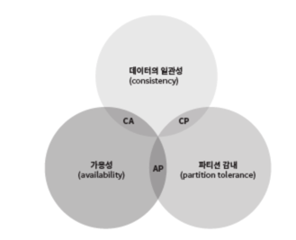
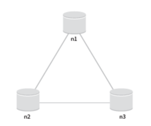
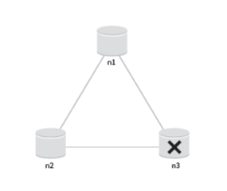
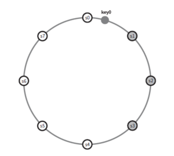

# 키-값 저장소 설계

## 📌 개요
- 키-값 저장소는 **Key-Value Database**라고도 불리는 비관계형 DB  
- 데이터는 **고유한 키와 값의 쌍(pair)** 으로 저장됨
- 주요 연산:
  - `put(key, value)` → 저장
  - `get(key)` → 조회

---

## ✏️ 문제 이해 및 설계 범위
- 키-값 쌍 크기: **10KB 이하**
- **대용량 데이터 저장** 지원
- **높은 가용성** → 장애 시에도 빠른 응답
- **높은 확장성** → 트래픽에 따라 서버 자동 증설/삭제
- **데이터 일관성 수준 조절 가능**
- **짧은 응답 지연시간**

---

## ✏️ 단일 서버 키-값 저장소
- 한 서버에 해시 테이블로 데이터 저장 가능 → 빠른 접근  
- 문제: 모든 데이터를 메모리에 저장 불가
- 해결책:
  - **데이터 압축**
  - **자주 쓰이는 데이터만 메모리 캐싱**
  - 나머지는 디스크 저장
- 결국 한 대로는 한계 → **분산 키-값 저장소 필요**

---

## ✏️ 분산 키-값 저장소
- **분산 해시 테이블 (DHT)** 기반
- 설계 시 **CAP 정리** 고려 필요

### CAP 정리
- **Consistency(일관성)**: 어떤 노드에 접속하든 동일 데이터
- **Availability(가용성)**: 일부 노드 장애에도 항상 응답
- **Partition Tolerance(파티션 감내)**: 네트워크 장애에도 동작

> 분산 시스템은 P(파티션 감내)를 항상 전제해야 하므로 **C와 A 중 하나를 선택**해야 한다.

위 그림에서 일관성과 가용성을 가져가고 파티션감내를 희생한 CA시스템은 실세계에 존재하지 않는다고 한다. 왜냐하면 네트워크 장애는 피할 수 없는 일로 여겨져 파티션 감내를 할 수 있도록 분산 시스템은 설계되어야 하기 때문이다.

위의 설계 예시를 들려면 먼저 이상적인 상태를 봐야한다.

분산 시스템에서 데이터는 여러 노드에 복제되어 보관된다. 위 그림에서 n1, n2, n3는 노드이고, 모두 원본 데이터를 완벽히 복제한 상태이다. 이상적인 환경이라면 네트워크가 파티션이 일어나지 않을 환경이다. 이런 경우 데이터 일관성과 가용성도 만족된다.

> n3가 고장난 상태. n1, n2과 통신 불가능

일관성 을 선택한다면 데이터 불일치 문제를 피하기 위해 n1,n2에 쓰기 연산을 중단시켜야하는데, 그렇게 하면 가용성이 깨진다. 은행 시스템처럼 어느 서버에 들어가든 계좌의 같은 정보를 조회해야하는 곳은 일관성을 양보하지 못한다. 하지만 쓰기 연산을 중단하여 최신 계좌를 반환하지 못하는데, 어쩔 수 없이 파티션 문제를 해결할 때까지 오류를 반환하는 수 밖에 없다.

가용성 을 선택한다면 설사 낡은 데이터를 반환할 위험이 있더라도 계속해서 읽기 연산을 허용해야 한다. n1, n2는 계속 쓰기를 허용할 것이고, 파티션 문제가 해결 된 뒤에 새 데이터를 n3에 전송할 것이다.

---

## ✏️ 시스템 컴포넌트

### 1. 데이터 파티션
- 데이터를 여러 파티션으로 나눠 저장
- 목표: 균등 분산, 서버 증감 시 최소한의 데이터 이동
- **안정 해시(Consistent Hashing)** 활용

### 2. 데이터 다중화 (Replication)

> N이 3개이면 key0은 s1, s2, s3에 저장된다.

하지만, 가상 노드를 사용하면 가상 노드도 순회하면서 복사본을 저장하고 카운터를 올려주므로 실제 물리적 서버는 1군데만 거칠 수 있다.(s1이라는 서버를 가기 전에 s1을 가리키는 가상 노드 3개를 이미 거친 경우)

이런 경우를 대비하기 위해 같은 물리 서버를 중복 선택하지 않도록 해야한다.

같은 데이터 센터에 속한 노드들은 정전, 네트워크 이슈, 자연재해 등의 문제를 동시에 겪을 수 있으므로 데이터 사본들을 다른 센터의 서버에 보관하고, 센터의 네트워크 품질을 높이는 방법도 고려해봐야 한다.

- 데이터 사본을 N개의 서버에 분산 저장
- 가용성/안정성 확보
- 같은 데이터센터에만 사본 저장 ❌ → **다른 센터에도 저장 필요**

### 3. 데이터 일관성
- **Quorum Consensus** 프로토콜
  - N = 사본 개수
  - W = 쓰기 정족수
  - R = 읽기 정족수
  - W+R > N → 강한 일관성 보장
- 예:
  - W=N, R=1 → 읽기 빠름
  - W=1, R=N → 쓰기 빠름

### 4. 일관성 모델
- **강한 일관성**: 항상 최신 데이터
- **약한 일관성**: 최신 데이터 보장 안 됨
- **최종 일관성**: 결국 모든 사본에 동기화
- Dynamo, Cassandra → 최종 일관성 모델 채택

#### 비일관성 해소: 데이터 버저닝
- 데이터 수정 시 버전을 생성
- 충돌 해결 기법 → **Vector Clock**

### 5. 장애 처리
- **장애 감지**: Gossip Protocol 활용
- **일시적 장애 처리**: Hinted Handoff (임시 위탁)
- **영구 장애 처리**: Anti-Entropy 프로토콜 + Merkle Tree 동기화

---

## ✏️ 시스템 아키텍처

### 쓰기 경로
1. 커밋 로그 기록
2. 메모리 캐시 기록
3. 캐시 임계치 도달 시 디스크의 **SSTable**에 기록

### 읽기 경로
1. 메모리 캐시에 있으면 즉시 반환
2. 없으면 Bloom Filter로 SSTable 검색
3. SSTable에서 데이터 조회 후 반환

---

# 📌 요약
- 키-값 저장소는 단순한 구조지만 **대규모 환경**에선 분산 설계 필요
- **CAP 정리**에 따라 C와 A 중 트레이드오프 결정
- **안정 해시 + 가상 노드**로 파티션 분산
- **Replication**으로 가용성 확보
- **Quorum(W, R, N)** 값으로 일관성과 응답속도 조절
- **Vector Clock**으로 충돌 해결
- **Gossip Protocol + Hinted Handoff + Merkle Tree**로 장애 감지/복구
- 쓰기 경로: Commit Log → Memtable → SSTable  
- 읽기 경로: Cache → Bloom Filter → SSTable

  

#### 참고하면 좋은 포스팅
- https://jjhwqqq.tistory.com/323