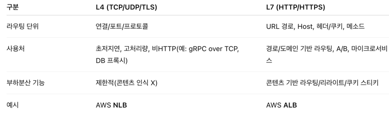

# RDBMS vs NoSQL & 시스템 확장 아키텍처

## 📌 RDBMS vs NoSQL

### 대부분은 RDBMS 사용
- **RDBMS 장점**: 트랜잭션 보장(ACID), 복잡한 쿼리, SQL 표준화, 데이터 무결성 보장
- **NoSQL 장점**: 분산 시스템 친화적, 스키마 유연성, 대규모 수평 확장 용이
- **NoSQL 고려 상황**
  - 아주 낮은 응답 지연시간이 필요할 때
  - 비정형 데이터를 다룰 때
  - 데이터(JSON, YAML, XML 등)를 직렬화/역직렬화만 하면 될 때
  - 대용량 데이터를 저장해야 할 때

>RDBMS는 데이터 일관성과 복잡한 질의에 강하고, NoSQL은 확장성과 유연성이 필요한 대규모 시스템에서 강점이 있다

---

## 규모 확장 (Scalability)

### 수직적 확장 (Scale-up, Vertical Scaling)
- **개념**: 서버에 더 좋은 CPU, RAM 등 고사양 자원을 추가
- **적합 상황**: 트래픽이 많지 않을 때
- **장점**
  - 단순하다.
- **단점**
  - 한계가 존재한다. (무한 자원 증설 불가)
  - 서버 장애 발생 시 자동 복구/다중화 불가 → 서비스 전체 중단 위험

### 수평적 확장 (Scale-out, Horizontal Scaling)
- **개념**: 서버를 여러 대 추가하여 성능 개선
- **적합 상황**: 대규모 애플리케이션 지원 시

> Scale-up은 짧은 기간 내 성능 향상 필요할 때 유리, Scale-out은 장기적 트래픽 증가 대비에 유리.
---

## 로드밸런서 (Load Balancer)

- 사용자가 직접 웹 서버에 연결되면, 서버 다운 시 서비스 불가  
- 너무 많은 접속자가 몰리면 응답 속도 저하/접속 불가 발생  
- 해결책: **로드밸런서** 사용
  - 사용자는 로드밸런서의 **Public IP**로 접속
  - 서버 간 통신은 **Private IP** 사용
- **장점**
  - 트래픽 분산
  - 가용성과 안정성 향상

### 로드밸런서 심화 - 알고리즘, 언제 무엇을 쓰나

근거: NGINX 공식 문서의 HTTP/TCP 로드밸런싱 방법(라운드로빈/최소연결/IP 해시/해시).

### L4 vs L7 선택 가이드

근거: AWS 문서—ALB는 L7에서 콘텐츠 기반 라우팅, NLB는 L4에서 초고성능/초저지연 처리.

---

## 데이터베이스 다중화 (Replication)

- **구조**:  
  - **Primary (Master)** → insert, update, delete  
  - **Replica (Slave)** → read 전용  
- **특징**
  - 읽기 연산을 Replica로 분산 → 성능 향상
  - Master 장애 시 안정성 저하 문제 존재
- **효과**
  - 성능 향상
  - 안정성 증가
  - 가용성 보장

> 한계점 : 읽기 부하는 줄어들지만 쓰기 부하는 여전히 Master에 집중됨 → 샤딩과 병행 고려 필요.
---

## 📌 응답시간 개선 (Latency Optimization)

### 캐시 (Cache)
- **적합 상황**: 데이터 갱신은 적지만 참조가 빈번할 때
- **주의사항**
  - 캐시에는 영속 데이터 저장 ❌ (휘발성 메모리 사용)
  - 만료 정책 설정 필요 (짧으면 DB 부하, 길면 원본과 불일치)
  - 일관성 보장 문제 존재 (DB 갱신 ↔ 캐시 갱신 불일치 가능)
  - SPOF(단일 장애 지점) 방지 → 여러 캐시 서버 분산 필요
  - 메모리 부족 시 데이터 방출 정책 필요
    - **LRU** (가장 오래 사용 안 된 데이터)  
    - **LFU** (사용 빈도가 낮은 데이터)  
    - **FIFO** (가장 먼저 들어온 데이터)

### CDN (Content Delivery Network)
- **개념**: 지리적으로 분산된 서버 네트워크 → 정적 콘텐츠(이미지, JS, CSS 등) 캐시
- **동작 방식**
  1. 사용자 요청 시 CDN에 콘텐츠 없으면 원본 서버에서 가져와 저장
  2. 이후 요청은 CDN에서 직접 반환
- **주의사항**
  - 비용 발생 → 자주 사용되는 콘텐츠만 배치
  - 만료 시한 관리 필요
  - 장애 대응: 원본 서버로 fallback 설정
  - 콘텐츠 무효화 방법
    - CDN 사업자 제공 API
    - 오브젝트 버저닝 (예: `image.png?v=2`)

>캐시는 동적 데이터(DB 결과 등) 최적화, 
CDN은 정적 데이터(이미지, JS, CSS 등) 최적화. 
캐시 계층(Local cache, Redis, Memcached) → DB 앞단, CDN → Web server 앞단.
---

##  무상태(Stateless) 웹 계층

- 상태 정보(세션 등)를 웹 서버에 저장하면 확장성 저하  
- 해결책: 상태 정보를 공유 저장소(DB, Redis, NoSQL) 또는 JWT 기반 인증으로 관리  
- 효과: 트래픽에 따라 웹 서버를 자유롭게 추가/제거 가능  

### 세션 일관성을 확보하는 3가지 대표 전략
#### 옵션 A) Redis 세션 스토어 (Stateful, 외부공유)

- **아이디어**: 세션을 각 웹 서버가 아닌 Redis에 저장 → 어떤 인스턴스가 처리해도 세션 조회 가능
- **장점**
  - 단순하고 검증된 방식
  - 회수/폐기 용이
  - 즉시 무효화 가능
- **주의**
  - 네트워크 홉 비용 (커넥션 풀 튜닝 필요)
  - Redis 고가용성(Replica/클러스터) 설계
  - TTL 및 세션 사이즈 관리 필요

#### 옵션 B) DB 공유 세션 (Stateful, 외부공유)

- **아이디어**: 세션을 RDBMS 테이블에 저장 (`spring-session-jdbc`)
- **장점**
  - 신규 인프라 없이 빠른 도입 가능
  - 트랜잭션/백업 친화적
- **주의**
  - 대규모 트래픽에서 DB 락/IO 부하 발생
  - 캐시 레이어나 Redis로 이전 고려 필요
- **적합 상황**
  - 트래픽이 낮은 초기 단계
  - 관리형 DB만 있는 환경

#### 옵션 C) JWT (Stateless)

- **아이디어**: 세션 상태를 서버가 들고 있지 않고, 서명된 토큰(JWT)에 클레임으로 담아 클라이언트가 보관. 서버는 서명 검증만 수행.
- **장점**
  - 완전 무상태 설계
  - 수평 확장 용이
  - LB/캐시 구조 단순화
- **주의/보안 포인트**
  - 즉시 무효화 어려움 → Access Token 짧게(10~30분), Refresh Token 길게(7~30일), 토큰 로테이션 + 블랙리스트 설계
  - 보관 위치: HttpOnly + Secure + SameSite 쿠키 권장 (로컬 스토리지 X)
  - 예상한 서명 알고리즘만 허용 (alg 혼동 공격 방지)
  - 강한 키 관리 필수
  - 민감 정보는 페이로드에 저장 금지 (서명은 암호화가 아님)

#### 선택 가이드

- **세션 즉시 무효화 / 강제 로그아웃 중요** → Redis / DB 공유 세션 (옵션 A/B)
- **대규모 수평 확장 + 간단한 인증 흐름** → JWT (옵션 C) + 블랙리스트 / 토큰 로테이션
- **초기 / 저트래픽 환경** → DB 공유로 시작 → 트래픽 증가 시 Redis 또는 JWT로 단계적 이전

---

##  데이터 센터 설계

- 여러 데이터 센터 사용 시, 지리적으로 가까운 데이터 센터로 연결 (GeoDNS)  
- **해결해야 할 문제**
  - 트래픽 우회: 장애 발생 시 올바른 데이터 센터로 라우팅
  - 데이터 동기화: DB 다중화 필요
  - 테스트 & 배포: 여러 위치에서 자동화된 배포 필요

---

##  메시지 큐 (Message Queue)

- **역할**: 비동기 통신, 메시지 무손실 보장, 서비스 간 결합도 낮춤
- **구성**
  - 생산자(Producer/Publisher) → 메시지 발행
  - 소비자(Consumer/Subscriber) → 메시지 수신 및 처리
- **장점**
  - 생산자와 소비자의 독립적 동작 가능
  - 서비스 장애와 무관하게 메시지 송수신 가능
  - 규모 확장성 보장

---

## 로그, 메트릭, 자동화

### 로그
- 서버 단위보다는 중앙 집중식 관리가 유리
- 예: **ELK Stack (Elasticsearch + Logstash + Kibana)**, **Fluentd**

### 메트릭
- **호스트 메트릭**: CPU, 메모리, 디스크 I/O
- **시스템 메트릭**: DB, 캐시 계층 성능
- **비즈니스 메트릭**: DAU, 매출, 재방문율
- 예: **Prometheus, Grafana**

### 자동화
- 테스트 및 배포 자동화 → **Jenkins, GitHub Actions, ArgoCD**

---

## 데이터베이스 규모 확장

### 1. 수직적 확장 (Vertical Scaling)
- 하드웨어 자원 증설 (CPU, RAM)

### 2. 수평적 확장 (Horizontal Scaling)
- 여러 DB 서버 추가 → **샤딩(Sharding)** 기법 사용

#### 샤딩 (Sharding)
- 대규모 DB를 작은 단위(Shard)로 분할
- 모든 샤드는 동일한 스키마 사용, 데이터 중복 없음
- **샤딩 키(Partition Key)** 로 데이터 분산  
  - 예: `user_id % 4` → 4개의 샤드에 균등 분배

#### 샤딩 고려사항
- 균등한 데이터 분포 (Hotspot 방지)
- 재샤딩 필요 시 안정 해시 기법 활용
- 조인 어려움 → 비정규화 고려
- 유명인사 문제(Hotspot Key) 방지
#### 샤딩의 실제 사례
- 트위터 -> user Id 기반 샤딩
- 게임 서버 -> Region(서버 군집)기반 샤딩

---

# 결론

- **RDBMS**: 데이터 무결성과 복잡한 쿼리에 강함  
- **NoSQL**: 비정형 데이터, 대용량 트래픽, 수평적 확장에 강함  
- **확장 전략**: 캐시, CDN, 무상태 설계, 메시지 큐, 로드밸런서, 샤딩, 데이터센터 분산, 자동화 도구 활용  

> 나의 생각, 
> 대부분의 서비스는 RDBMS로 시작한다.
>  트랜잭션 보장과 관계형 모델이 강점이기 때문이다.  하지만 대규모 트래픽 환경이나 비정형 데이터 처리에서는 NoSQL이 더 적합할 수 있다.  RDBMS는 Scale-up(Vertical scaling) 으로 단기간 대응하기 쉽지만 한계가 있고, 장기적으로는 Scale-out(Horizontal scaling) 과 샤딩, 캐시, CDN, 무상태 아키텍처 등을 통한 확장이 필요하다.  이를 뒷받침하기 위해 로드밸런서(L4/L7), Primary/Replica 구조, Redis/Memcached 캐시, CDN, Sharding, 메시지 큐(Kafka, RabbitMQ), 그리고 로그/메트릭 모니터링(ELK, Prometheus, Grafana) 이 조합되어야 한다고 생각한다.