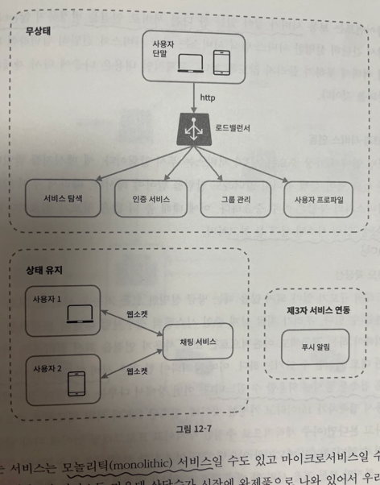
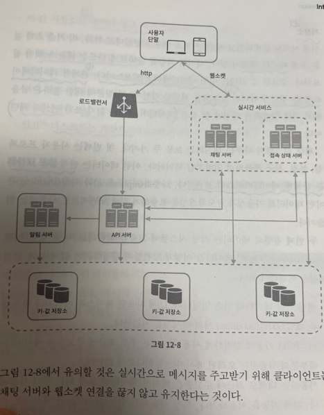
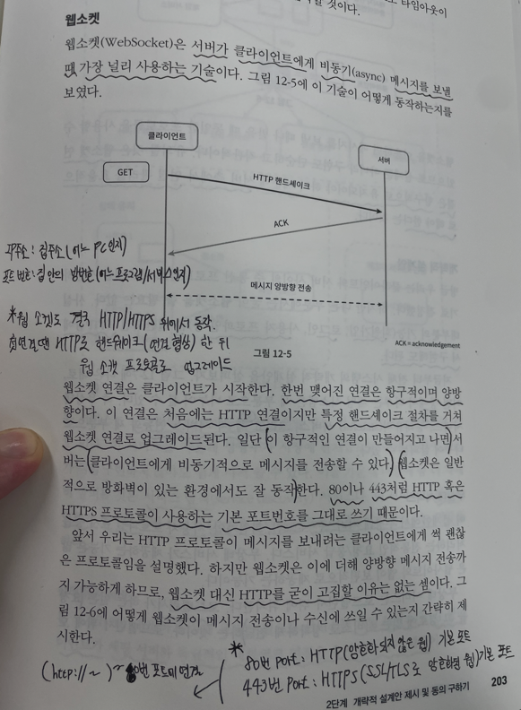

### 폴링

### 롱 폴링

### 웹 소켓

개략적 설계안 (1)

개략적 설계안(2)

## 메시지 흐름

1:1 채팅 메시지 처리 흐름

여러 단말 사이의 메시지 동기화

소규모 그룹 채팅에서의 메시지 흐름

## 접속상태 표시

사용자 로그인

로그아웃

접속 장애

상태 정보 전송

### 피드백

단어 및 아키텍처만 작성해두고, 그것에 대해 전부 다 디테일하게 말을 하려다보니 놓치는 부분이 있고, 해당 챕터는 말로 설명하기 어려운 것을 설명하다 보니 혼동이 오니 아예 간략하게 말로만 편하게 이해될정도로 러프하게 하거나 그림을 그려가면서 디테일하게 설명하는 둘 중 하나를 선택하는 것이 좋을 것 같음.

-> 면접때도 애매하게 말하면 오히려 중구난방이 되게 된다. 차라리, 간략하게 설명하거나 정리해서 딥하게 설명하자.

⇒ 이번 기회를 통해, 발표 전에 한 번 검토하는 것이 좋음을 느낌.

⇒ 본인이 발표하고, 이해가 안된다면, 그 이해 안되는 부분을 다시 한 번 어떻게 잘 말할지, 본인부터 이해하고 잘 말할 수 있도록 정리해보기.