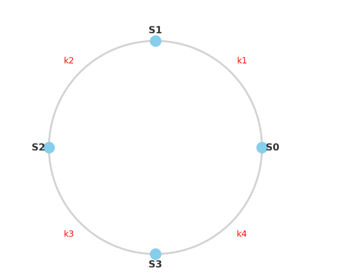
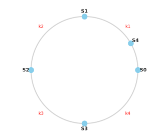
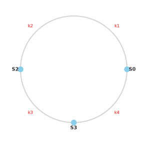
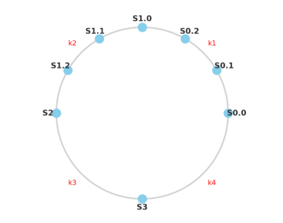

# 안정 해시 (Consistent Hashing)

수평적 규모 확장을 위해서는 **요청 또는 데이터를 균등하게 나누는 것**이 중요하다.  
안정 해시는 이 목표를 달성하기 위해 널리 쓰이는 기술이다.

---

## 해시 키 재배치 문제

일반적인 해시 방식: serverIndex = hash(key) % N # N = 서버 개수

### 잘 동작하는 경우
- 서버 풀이 고정되어 있을 때
- 데이터 분포가 균등할 때

### 문제 상황
- 서버 추가/삭제 시 대부분의 키가 재배치됨
- → **대규모 캐시 미스** 발생

---

## 🌱 안정 해시 (Consistent Hashing)

> 해시 테이블 크기(=서버 수)가 변할 때 평균적으로 **k/n 개의 키만 재배치**되는 해시 기술  
> (k = 키 개수, n = 슬롯 개수)

### 해시 테이블 의미
- 여기서의 "해시 테이블"은 자료구조의 해시 테이블이 아님
- 데이터를 여러 서버에 **분산 저장하기 위한 논리적 구조**
- 보통 **원형 링(Hash Ring)** 형태로 표현됨

---

##  해시 링(Hash Ring)

- 해시 함수의 출력 공간을 원형으로 배치  
- 서버와 키를 모두 동일 해시 함수로 링 위에 매핑  
- **키 조회**: 키 위치에서 **시계 방향**으로 탐색 시 최초로 만나는 서버에 저장

---

## 서버 추가/제거 예시

- **서버 추가**: 일부 키만 새 서버로 이동

- **서버 제거**: 일부 키만 다른 서버로 이동  
- → 전체 키 재배치가 아닌 **국소적 재배치**

---

## 기본 구현의 문제

1. **파티션 크기 불균형**
   - 인접 서버 간 해시 공간 크기가 달라짐
2. **키 분포 불균형**
   - 특정 서버에 키가 몰릴 수 있음

---

##  해결책: 가상 노드 (Virtual Node)
(가상 노드 적용)

- 실제 서버를 여러 개의 가상 노드로 링에 배치
- 예: `s0 → s0.0, s0.1, s0.2 ...`  
- 키는 최초로 만나는 가상 노드가 담당 서버로 매핑됨

### 효과
- 가상 노드 개수 ↑ → 키 분포가 균등해짐 (표준편차 ↓)
- 단, 가상 노드 메타데이터 저장 공간 ↑ → **Trade-off 존재**

---

## 키 재배치 범위

- **서버 추가**: 새 서버 ~ 반시계 방향의 인접 서버까지의 키 재배치
- **서버 삭제**: 삭제된 서버 ~ 반시계 방향의 인접 서버까지의 키 재배치

---

# 정리

- 단순 해시(`hash(key) % N`)는 서버 증감 시 전체 키 재배치 문제를 유발 → **대규모 캐시 미스**  
- **안정 해시**는 해시 링을 기반으로 설계되어, 서버 증감 시 일부 키만 재배치됨  
- **문제점**: 파티션 불균형, 키 분포 불균형  
- **해결책**: 가상 노드 기법을 사용하여 균등 분포 달성  
- **의의**: 안정 해시는 **분산 캐시, 분산 스토리지, 샤딩** 등 대규모 시스템에서 필수적인 확장성 기술
