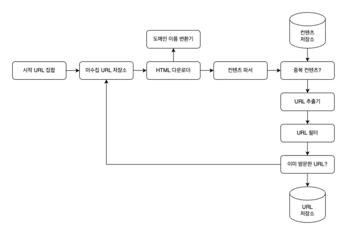
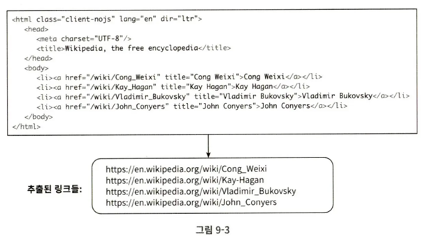
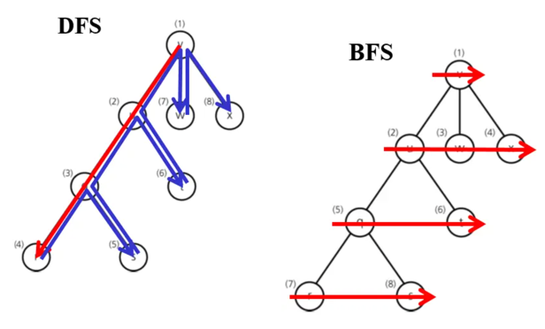
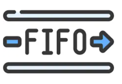
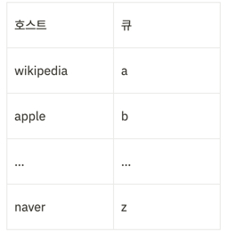
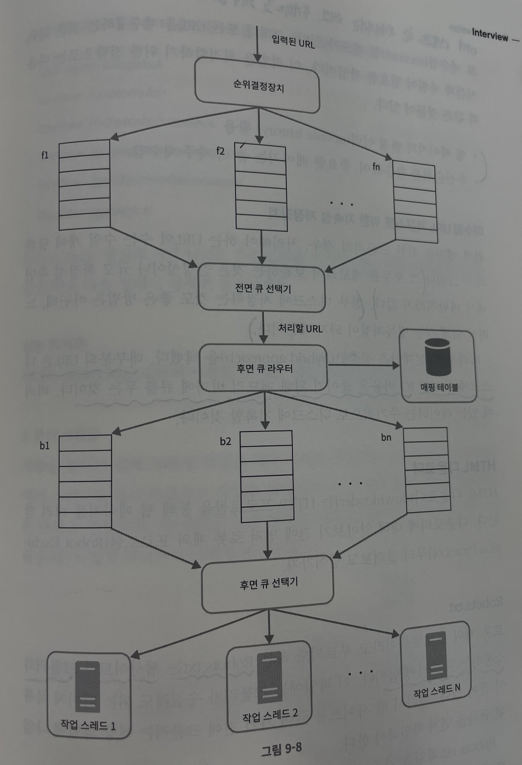
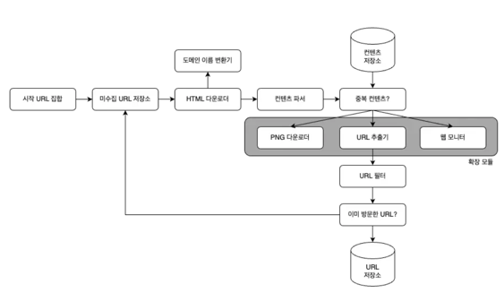

일반적으로 크롤러란, 웹 페이지의 컨텐츠를 찾아 자동으로 검색하고 스캔하는 프로그램을 말한다.
 
크롤러는 다양하게 이용된다.
 
- 검색 엔진 인덱싱 : 크롤러의 가장 보편적인 예시로서, 웹 페이지를 모아 검색 엔진을 위한 로컬 인덱스를 만든다. 구글봇은 구글 검색엔진이 사용하는 웹 크롤러다.
- 웹 아카이빙 : 나중에 사용할 목적으로 장기보관하기 위해 웹에서 정보를 모으는 절차를 말한다.
- 웹 마이닝 : 크롤러를 사용해 정보를 모으고 해당 정보를 통해 데이터 마이닝을 하는 것을 의미한다.
- 웹 모니터링 : 웹 크롤러를 통해 저작권이나 상표권이 침해된 사례를 찾아낸다.
 
## 1단계 - 문제 이해 및 설계 범위 확정
웹 크롤러의 기본 알고리즘은 다음과 같다.
 
1. URL 집합이 주어지면, 해당 URL들이 가리키는 웹 페이지를 다운로드 한다.
2. 다운로드 웹 페이지에서 URL들을 추출한다.
3. 추출된 URL들을 다운로드 할 URL 목록에 추가하고 위의 과정을 처음부터 다시 반복한다.
 
웹 크롤러는 위 처럼 단순하게 작동하지 않기 때문에 상세한 내용을 살펴봐야 한다. 중요 속성은 다음과 같다.
- 규모 확장성 : 웹은 거대하다. 병렬로 돌아갈 수 있다면 보다 더 효과적으로 크롤링 할 수 있을 것이다.
- 안정성 : 웹은 함정으로 가득하다. 잘못 작성된 HTML, 응답 없는 서버, 장애, 악성 코드 등 다양한 요소가 있다. 비정상적이나 악의적인 요소에 대응할 수 있어야 한다.
- 예절 : 웹 사이트에 너무 잦은 요청을 보내서는 안된다.
- 확장성 : 새로운 형태의 콘텐츠를 지원하기가 쉬워야 한다. 이미지 비디오, pdf 등 다양한 컨텐츠에 대응 가능한 크롤러가 설계되야 한다.
 
먼저, 어떤 용법을 위해 사용되는 크롤러인지 정의되야 한다.
 
책에서는, 검색 엔진 인덱싱을 예시로 들고 있다. 요구사항은 다음과 같다.
- 매달 10억 개의 웹 페이지를 다운로드 한다.
- QPS = 10억 / 30일 / 24시간 / 3600초 = 대략 초 당 400페이지
- 최대 QPS = 2 * QPS = 800
- 웹 페이지 크기 평균은 500kb라고 가정
- 10억 페이지 * 500kb = 500TB / month
- 1개월치 데이터를 보관하는 데는 500TB, 5년간 보관한다면 500TB * 12 개월 * 5년 ⇒ 30PB의 용량을 확보해야 한다
 
## 2단계 - 개략적 설계안 제시 및 동의 구하기
#### 웹 크롤러 작업 흐름


1. 시작 URL들을 미수집 URL 저장소에 저장
2. HTML 다운로더는 미수집 URL 저장소에서 URL 목록을 가져온다.
3. HTML 다운로더는 도메인 이름 변환기를 사용하여 URL의 IP 주소를 알아내고, 해당 IP 주소로 접속하여 웹페이지를 다운받는다.
4. 컨텐츠 파서는 다운된 HTML 페이지를 파싱하여 올바른 형식을 갖춘 페이지인지 검증한다.
5. 컨텐츠 파싱과 검증이 끝나면 중복 컨텐츠인지 확인하는 절차를 개시한다.
6. 중복 컨텐츠인지 확인하기 위해서, 해당 페이지가 이미 저장소에 있는지 본다.
   - 이미 저장소에 있는 컨텐츠인 경우에는 처리하지 않고 버린다
   - 저장소에 없는 컨텐츠인 경우에는 저장소에 저장한 뒤 URL 추출기로 전달한다.
7. URL 추출기는 해당 HTMl 페이지에서 링크를 골라낸다.
8. 골라낸 링크를 URL 필터로 전달한다.
9. 필터링이 끝나고 남은 URL만 중복 URL 판별 단계로 전달한다.
10. 이미 처리한 URL인지 확인하기 위하여, URL 저장소에 보관된 URL인지 살핀다. 이미 있으면 버림
11. 저장소에 없는 URL은 URL 저장소에 저장할 뿐 아니라 미수집 URL 저장소에도 전달한다.

### 시작 URL 집합
시작 URL 집합은 웹 크롤러가 크롤링을 시작하는 출발점이다. 예를 들어, 어떤 대학 웹사이트로부터 찾아 나갈 수 있는 모든 웹 페이지를 크롤링하는 가장 직관적 방법은 해당 대학의 도메인 이름이 붙은 모든 페이지를 URL 시작 집합으로 삼는 것이다.
 
시작 URL 집합을 어떤 단위로 삼을지 지역적 특색이든, 스포츠 공간 이든 정답은 없기 때문에 요구사항에 맞춰 시작 집합을 선정하면 된다.
 
### 미수집 URL 저장소
웹 크롤러는 크롤링 상태를
- 다운로드 할 URL
- 다운로드된 URL

두 가지로 나눠서 관리한다. 이 중 다운로드할 URL을 저장 관리하는 컴포넌트를 미수집 URL 저장소라 한다. FIFO 큐라고 생각하면 된다.
 
#### HTML 다운로더
```javascript
import requests

def download_html(url):
    response = requests.get(url)
    if response.status_code == 200:
        return response.content.decode('utf-8')
    else:
        raise Exception("Failed to download HTML from {}: {}".format(url, response.status_code))
```
 
그냥 HTML을 웹 사이트로부터 다운 받아 저장하는 용도다. 다운로드 할 페이지는 이전 단계의 미수집 URL 저장소가 제공한다.
 
#### 도메인 이름 변환기
 
```javascript
import requests

def download_html(url):
    response = requests.get(url)
    if response.status_code == 200:
        return response.content.decode('utf-8')
    else:
        raise Exception("Failed to download HTML from {}: {}".format(url, response.status_code))

def get_domain_name(url):
    domain_name = urlparse(url).netloc
    if domain_name.startswith("www."):
        domain_name = domain_name[4:]
    return domain_name
```
 
웹 페이지를 받으려면 URL을 IP 주소로 변환하는 절차가 필요하다. HTML 다운로더는 도메인 이름 변환기를 사용하여 URL에 대응되는 IP 주소로 변환한다.
 
### 콘텐츠 파서
웹 페이지를 다운로드 하면 파싱과 검증 절차를 거쳐야 한다. 크롤링 서버 안에 파서를 두면 크롤링 과정이 느려지기 때문에 독립 컴포넌트로 따로 구성한다.
 
### 중복 콘텐츠인가?
요구사항에는 중복 컨텐츠는 배제한다고 되어있다. 연구 결과에 따르면 29% 가량의 웹 페이지 콘텐츠는 중복이다. 가장 간단한 건 문자를 비교하는 것이지만 효율이 안좋고 가장 좋은 방법은 해시 값을 비교하는 것이다.
 
### 콘텐츠 저장소
콘텐츠 저장소는 다운로드 한 HTML 문서를 보관하는 시스템이다. 저장소 구현 기술은 데이터의 크기 유형 저장소 접근 빈도, 데이터 유효 기간등을 고려하여 선택해야 한다. 본 설계안의 경우 디스크와 메모리 둘 다 사용하는 방식으로 접근한다.

### URL 추출기


HTML 페이지를 파싱하여 링크들을 골라내는 역할을 한다. 상대 경로는 전부 특정 도메인을 붙여 절대 경로로 변환한다.

### URL 필터
특정 콘텐츠 타입이나 파일 확장자를 갖는 URL, 접속 시 오류가 발생하는 URL, 접근 제외 목록에 포함된 URL 등을 크롤링 대상에서 배제하는 역할을 한다.

### 이미 방문한 URL?
이미 방문한 URL이나 미수집 URL 저장소에 보관된 URL을 추적할 수 있도록 하는 자료 구조를 이용할 것이다. 이미 방문한 URL을 계속해서 방문하게 되면 시스템이 무한 루프에 빠지거나 서버에 부하가 걸릴 수 있다. 해당 자료 구조는 블룸 필터나 해시 테이블이 널리 쓰인다.
 
### URL 저장소
URL 저장소는 이미 방문한 URL을 보관하는 저장소다.

## 3단계 - 상세 설계
컴포넌트와 구현 기술에 대해서 심도있게 살펴보면,
 
### DFS를 쓸 것인가, BFS를 쓸 것인가

웹은 유향 그래프와 같다. 각 페이지는 노드고, 하이퍼링크는 에지다. 크롤링 프로세스는 이 유향 그래프를 탐색하는 과정이다. DFS와 BFS는 이 그래프 탐색에 널리 쓰이는 방식이다.
 
DFS, 깊이 우선 탐색은 좋은 선택이 아닐 가능성이 크다. 그래프의 deepth를 어느 정도인지 웹 크롤링 과정에서 측정하기 어렵기 때문이다. 따라서 웹 크롤러는 BFS, 너비 우선 탐색을 사용한다. 



BFS는 FIFO 큐를 사용하는 알고리즘이다. 이 큐의 한쪽으로는 탐색할 URL을 집어넣고, 다른 한쪽으로는 꺼내기만 한다. 이 구현법에는 두 가지 문제가 있다.
 
- 한 페이지에서 나오는 링크 상당수는 같은 서버로 되돌아간다. wikipedia.com 페이지에서 추출한 링크는 동일한 wikipedia.com 서버의 다른 페이지를 참조하는 링크다. 크롤러는 같은 호스트에 속한 많은 링크를 받기 위해 바빠지는데, 링크들을 병렬로 처리하게 되면 서버는 과부하로 죽어버릴 것이다. 이런 크롤러를 보통 예의 없는 크롤러(impolite)라고 한다.
- 표준적 BFS 알고리즘은 URL 간에 우선순위를 두지 않는다. 처리 순서가 같은 너비에 있다면 공평하게 적용된다는 소리인데, 모든 페이지가 같은 중요도를 갖지 않기 때문에 트래픽의 양, 업데이트 빈도 등 기준에 따라 차등적으로 구별하는 것이 맞을 것이다.

### 미수집 URL 저장소
위 문제들 특히 같은 페이지로 돌아가는 그런 문제들은 미수집 URL 저장소를 잘 구현하면 해결된다. 예의 갖춘 크롤러, 우선순위와 신선도를 구별하는 크롤러를 구현할 수 있다. 저자는 특정 논문을 읽고 이 미수집 URL 저장소 구현에 관한 내용을 요약하여 설명한다.
#### 예의
웹 크롤러는 수집 대상 서버로 짧은 시간 안에 너무 많은 요청을 보내는 것을 삼가야 한다. 너무 많은 요청을 보내는 것은 무례한 일이며 때로는 DoS 공격으로 간주된다.
 
예의 바른 크롤러를 구현하기 위한 한 가지 원칙은, 동일 웹 사이트에 대해서는 한 번에 한 페이지만 요청해야 한다는 것이다. 같은 웹 사이트의 페이지를 다운받는 태스크를 시간차를 두고 실행시키면 된다. 해당 요구 사항을 충족하려면 호스트명과 다운로드를 수행하는 스레드 사이의 관계를 유지하면 된다. 다운로드 스레드는 별도 FIFO 큐를 가지고 있어, 큐에서 꺼낸 URL만 다운로드 하도록 한다.



- Queue Router : 같은 호스트에 속한 URL은 언제나 같은 큐로 가도록 보장
- Mapping Table : 호스트 이름과 큐 사이의 관계를 보관하는 테이블
- FIFO Queue : 같은 호스트에 속한 URL은 언제나 같은 큐에 보관된다.
- Queue Selecter : 큐 선택기는 큐들을 순회하며 큐에서 URL을 꺼내 큐에서 나온 URL을 다운로드하도록 지정 스레드에 전달한다.
- Worker Thread : 작업 스레드는 전달된 URL을 다운로드하는 작업을 수행한다. 전달된 URL은 순차처리 될 것이며 지연시간(Latency)를 둘 수 있다.

#### 우선순위
크롤러는 중요도에 따라 중요도가 높은 페이지부터 수집하는 것이 바람직하다.
 
유용성에 따라 우선순위를 나눌 때 페이지 랭크(Page Lank), 트래픽 양, 갱신 빈도(Update Frequency) 등 다양한 척도를 사용할 수 있다.
 
- 순위결정장치(Prioritizer) : URL을 입력받아 우선순위를 계산한다.
- Queue(f1, … fn): 우선순위 별로 큐가 하나씩 할당된다. 우선순위가 높으면 선택될 확률도 올라간다.
- Queue Selecter: 임의 큐에서 처리할 URL을 꺼내는 역할을 담당한다. 순위가 높은 큐에서 더 자주 꺼내도록 설계된다.
 
다음은 위 과정을 반영한 설계다. 두 모듈이 존재하게 된다.



- 전면 큐 (Front Queue) : 우선순위 결정 과정을 처리한다.
- 후면 큐 (Back Queue) : 크롤러가 예의 바르게 동작하도록 보장한다.

#### 신선도
웹 페이지의 신선도를 위한 전략으로는 다음과 같은 것들이 있다.
 
- 웹 페이지의 변경 이력 활용
- 우선순위를 활용하여, 중요 페이지 자주 재수집

#### 미수집 URL 저장소를 위한 지속성 저장장치
URL 수가 수억개 이상이 되버렸는데 메모리를 계속 사용하면, 안정성이나 규모 확장 면에서 바람직하지 않다. 하지만, 디스크에 전부 저장하는 것도 속도 면에서 효율적이지 않다. 따라서 절충안인 대부분 URL은 디스크에 두지만 I/O 비용을 줄이기 위해 메모리 버퍼에 큐를 두는 것이다. 버퍼에 있는 데이터는 디스크에 주기적으로 저장한다.
 
### HTML 다운로더 
 
#### Robots.txt
 
Robots.txt는 웹 사이트가 크롤러와 소통하는 표준적 방법이다. 이 파일에는 크롤러가 수집해도 되는 페이지 목록이 들어 있다. 웹 사이트를 긁기 전 해당 파일에 나열된 규칙을 먼저 확인해야 한다.
 
이 파일은 주기적으로 다시 다운받아 캐시에 보관해야 한다.
 
#### 성능 최적화
 
1. 분산 크롤링<br>
성능을 높이기 위해 크롤링 작업을 여러 서버에 분산하는 방법이다. 각 서버는 여러 스레드를 돌려 다운로드 작업을 처리한다.
 
2. 도메인 이름 변환 결과 캐시<br>
도메인 이름 변환기(DNS Resolver)는 크롤러 성능 병목 중 하나인데, DNS 요청을 보내고 IP를 받아오기 까지의 작업의 동기적 특성 때문이다. 결과를 받기 전까지는 다음 작업을 할 수 없다는 단점이 있는데, DNS 조회 결과로 얻어진 도메인 이름과 IP 주소를 캐시에 보관해놓고 크론 잡으로 주기적으로 갱신하도록 하면 성능을 높일 수 있다.
 
3. 지역성 <br>작업 서버를 지역별로 분산하는 방법이다.

4. 짧은 타임아웃 <br>특정 웹 서버는 아예 응답이 없을 수 있기 때문에, 타임 아웃을 적절히 줄여 관리한다.
 
#### 안정성
 
1. 안정 해시 : 다운로드 서버들에 부하 분산을 적용할 때 사용할 수 있다.
2. 크롤링 상태 및 수집 데이터 저장 : 장애가 발생한 경우도 쉽게 복구할 수 있도록 상태와 데이터를 수시로 지속적 저장장치에 기록해두는 것이 바람직하다.
3. 예외 처리 
4. 데이터 검증

#### 확장성


확장성을 위해, PNG 파일을 다운로드 하는 PNG 플러그인 모듈이나, 웹 모니터가 추가 됐다.

#### 문제 있는 콘텐츠 감지 및 회피
 
1. 중복 컨텐츠 : 해시나 체크섬을 통해 탐지할 수 있다.
2. 거미 덫 : 크롤러가 무한 루프에 빠지도록 설계된 페이지의 경우 URL의 최대 길이를 제한하면 회피할 수 있다. 이런 사이트가 발견된다면 필터에 제한조건을 걸어두자.
3. 데이터 노이즈 : 가치 없는 콘텐츠는 배제

## 4단계 - 마무리
시간이 허락한다면, 다음과 같은 것을 추가적으로 논의하면 좋을 것이다.
 
- 서버 측 렌더링 : JS의 동작에 의해 링크가 생성되는 경우도 있기 때문에 페이지를 다운받아 파싱하기 전 다이나믹 렌더링을 거친다면 문제를 해결할 수 있을 것이다.
- 원치 않는 페이지 필터링 : 스팸 방지 컴포넌트를 두어 품질지 조악하거나 스팸성 페이지를 걸러내면 좋다.
- 데이터베이스 다중화 및 샤딩
- 수평적 규모 확장성 : Scale out될 수 있도록 준비해놓는 것이 좋고, 서버의 무상태성(stateless)을 유지하도록 만드는 것이 중요하다.
- 가용성 / 일관성 / 안정성
- 데이터 분석 솔루션