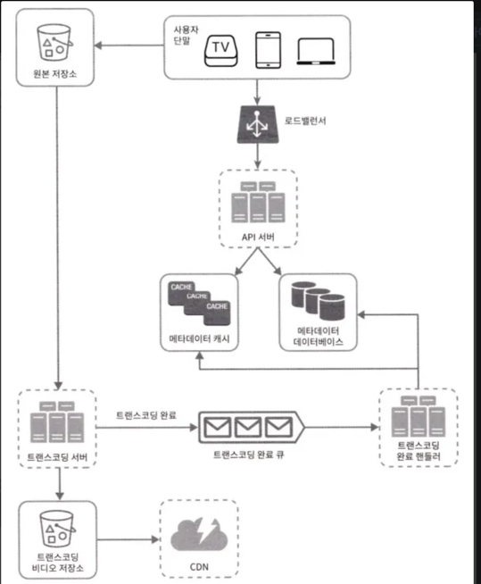

이번 장에서는 유튜브 시스템 설계하는 면접 문제를 풀어볼 것이다. 이 문제에 대한 답은 넷플릿스 같은 비디오 플랫폼을 설계하는 문제에도 적용 가능하다.

유튜브 시스템을 설계하기에 앞서 몇 가지 통계자료를 살펴보자(2020년 기준)

- MAU: 20억
- 매일 재생되는 비디오 수: 50억
- 미국 성인 가운데 73%가 유튜브 이용
- 5천만 명의 창작자
- 유튜브의 광고 수입은 2019년 기준으로 150억 달러이며 이는 2018년 대비 36% 증가한 수치
- 모바일 인터넷 트래픽 가운데 37%를 유튜브가 점유
- 80개 언어로 이용 가능

## 1단계: 문제 이해 및 설계 범위 확정

> 지원자: 어떤 기능이 가장 중요한가요?
> 
> 
> 면접관: 비디오를 올리는 기능과 시청하는 기능입니다.
> 
> **지원자: 어떤 클라이언트를 지원해야 하나요?**
> 
> 면접관: 모바일 앱, 웹 브라우저, 그리고 스마트 TV입니다.
> 
> **지원자: 일간 능동 사용자(DAU) 수는 몇 명입니까?**
> 
> 면접관: 5백만입니다.
> 
> **지원자: 다국어 지원이 필요한가요?**
> 
> 면접관: 네. 어떤 언어로도 이용 가능해야 합니다.
> 
> **지원자: 어떤 비디오 해상도를 지원해야할까요?**
> 
> 면접관: 현존하는 비디오 종류와 해상도를 대부분 지원해야 합니다.
> 
> **지원자: 암호화가 필요할까요?**
> 
> 면접관: 네
> 
> **지원자: 비디오 크기에 제한이 있습니까?**
> 
> 면접관: 비디오 크기는 최대 1GB로 제한합니다.
> 

### 비디오 스트리밍 서비스 기능

- 빠른 비디오 업로드
- 원활한 비디오 재생
- 재생 품질 선택 가능
- 낮은 인프라 비용
- 높은 가용성과 규모 확장성, 그리고 안정성
- 지원 클라이언트: 모바일 앱, 웹 브라우저, 스마트 TV

### 개략적 규모 추정

- DAU: 5백만
- 한 사용자는 하루 평균 5개 비디오 시청(30분)
- 10%의 사용자가 하루에 1비디오 업로드
- 비디오 평균 크기는 300MB
- 비디오 저장을 위해 매일 새로 요구되는 저장 용량 = 5백만 x 10% x 300MB = 150TB
- CDN 비용: AWS CloudFront에서 트래픽이 100% 미국에서 발생한다고 가정하면 1GB당 $0.02의 요금 발생.따라서 매일 발생하는 요금은 $150,000

## 2단계: 개략적 설계안 제시 및 동의 구하기

- 단말: 컴퓨터, 모바일 폰, 스마트 TV를 통해서 유튜브를 시청할 수 있다.
- CDN: 비디오는 CDN에 저장한다. 재생 버튼을 누르면 CDN으로부터 스트리밍이 이루어진다.
- API 서버: 비디오 스트리밍을 제외한 모든 요청은 API 서버가 처리한다. ex) 피드 추천, 메타데이터 데이터베이스와 캐시 갱신, 사용자 가입 등

유튜브 시스템 중 면접관이 가장 중요하다고한 비디오 업로드 기능과 비디오 스트리밍 기능에 대해 설계해 보자.

### 비디오 업로드 절차

- 사용자: 컴퓨터나 모바일 폰, 혹은 스마트 TV를 통해 유튜브를 시청하는 이용자다.
- 로드밸런서: API서버 각각으로 고르게 요청을 분산하는 역할을 담당한다.
- API 서버: 비디오 스트리밍을 제외한 모든 요청을 처리한다.
- 메타데이터 캐시: 성능을 높이기 위해 비디오 메타데이터와 사용자 객체를 캐시한다.
- 메타데이터 데이터베이스: 비디오의 메타데이터를 보관한다. 샤딩과 다중화를 적용하여 성능 및 가용성 요구사항을 충족한다.
- 원본 저장소: 원본 비디오를 보관할 대형 이진 파일 저장소(BLOB, Binary Large Object Storage) 시스템이다.
- 트랜스코딩 서버: 비디오 트랜스코딩은 비디오 인코딩이라 부르기도 하며, 비디오 포맷(MPEG, HLS 등)을 변환하는 절차이다. 단말이나 대역폭 요구에 맞는 최적의 비디오 스트림을 제공하기 위해 필요하다.
- 트랜스코딩 비디오 저장소: 트랜스코딩이 완료된 비디오를 저장하는 BLOB 저장소
- 트랜스코딩 완료 큐: 비디오 트랜스코딩 완료 이벤트를 보관할 메시지 큐
- 트랜스코딩 완료 핸들러: 트랜스코딩 완료 큐에서 이벤트 데이터를 꺼내어 메타데이터 캐시와 데이터베이스를 갱신할 작업 서버들이다.
- CDN: 비디오를 캐시하는 역할. 사용자가 재생 버튼을 누르면 비디오 스트리밍은 CDN을 통해 이루어진다.

### ※BLOB: 이진 데이터를 하나의 개체로 보관하는 데이터베이스 관리 시스템 - https://en.wikipedia.org/wiki/Object_storage

비디오가 업로드된다면 다음의 두 프로세스가 병렬적으로 수행된다.

a. 비디오 업로드

b. 비디오 메타데이터 갱신. 메타데이터에는 비디오 URL, 크기, 해상도, 포맷, 사용자 정보가 포함된다.

### 프로세스 a: 비디오 업로드

1. 비디오를 원본 저장소에 업로드한다.

2. 트랜스코딩 서버는 원본 저장소에서 해당 비디오를 가져와 트랜스코딩을 시작한다.

3. 트랜스코딩이 완료되면 아래 두 절차가 병렬적으로 수행된다.

3a. 완료된 비디오를 트랜스코딩 비디오 저장소로 업로드

3b. 트랜스코딩 완료 이벤트를 트랜스코딩 완료 큐에 넣는다.

3a.1. 트랜스 코딩이 끝난 비디오를 CDN에 올린다.

3b.1. 완료 핸들러가 이벤트 데이터를 큐에서 꺼낸다.

3b.1.a, 3b.1.b. 완료 핸들러가 메타데이터 데이터베이스와 캐시를 갱신한다.

4. API 서버가 단말에게 비디오 업로드가 끝나서 스트리밍 준비가 되었음을 알린다.

### 프로세스 b: 메타데이터 갱신

원본 저장소에 파일이 업로드되는 동안, 단말은 병렬적으로 비디오 메타데이터 갱신 요청을 API 서버에 보낸다.

이 요청에 포함된 메타데이터에는 파일 이름, 크기, 포맷 등의 정보가 들어 있다.

API 서버는 이 정보로 메타데이터 캐시와 데이터베이스를 업데이트한다.

### 프로세스 a의 메타데이터와 프로세스 b의 메타데이터

프로세스 a의 메타데이터: 트랜스코딩 이후에만 얻을 수 있는 데이터

- 최종 비디오 URL (CDN에 올라간 주소)
- 실제 해상도 (1080p, 720p 등)
- 여러 포맷 버전이 존재할 수 있음 (HLS, MP4 등)
- 최종 파일 크기 (압축되었을 수 있음)
- 썸네일 이미지, 재생 시간(duration) 등 추가 정보

프로세스 b의 메타데이터: 사용자가 아는 기본 정보

- 파일명
- 파일 크기
- 포맷 (예: mp4, avi)
- 업로더(사용자) 정보
- 업로드 시작 시점

### 비디오 스트리밍 절차

비디오는 CDN에서 바로 스트리밍된다. 사용자의 단말에 가장 가까운 CDN 에지 서버가 비디오 전송을 담당한다.

이때 CDN 에지 서버는 스트리밍 프로토콜을 통해 데이터를 내려받는다.

### 스트리밍 프로토콜

비디오 스트리밍을 위해 데이터를 전송할 때 쓰이는 표준화된 통신 방법

ex)

- MPEG-DASH. MPEG는 "Moving Picture Exports Group"의 약어이며, DASH는 "Dynamic Adaptive Streaming over HTTP"의 약어
- 애플 **HLS**. HLS는 "HTTP Live Streaming"

→ HLS 프로토콜 정리 해야함. 

- 마이크로소프트 스무드 스트리밍(MSS)
- 어도비 HTTP 동적 스트리밍(HDS)

각 프로토콜마다 지원하는 비디오 인코딩이 다르고 플레이어도 다르다. 따라서 비디오 스트리밍 서비스를 설계할 때는 서비스의 용례에 맞는 프로토콜을 잘 골라야 한다. (각 프로토콜 설명: https://www.dacast.com/blog/streaming-protocols/)

## 3단계: 상세 설계

### 비디오 트랜스코딩

### 비디오 트랜스코딩이 중요한 이유

- 가공되지 않은 원본 비디오는 저장 공간을 많이 차지한다.
- 상당수의 단말과 브라우저는 특정 종류의 비디오 포맷만 지원한다. 따라서 호환성 문제를 해결하려면 하나의 비디오를 여러 포맷으로 인코딩해 두는 것이 바람직하다.
- 사용자에게 끊김 없는 고화질 비디오 재생을 보장하려면, 네트워크 대역폭이 충분하지 않은 사용자에게는 저화질 비디오를, 대역폭이 충분한 사용자에게는 고화질 비디오를 보내는 것이 바람직하다.
- 모바일 단말의 경우 네트워크 상황이 수시로 달라질 수 있다. 비디오가 끊김 없이 재생되도록 하기 위해서는 비디오 화질을 자동으로 변경하거나 수동으로 변경할 수 있도록 하는 것이 바람직하다.

### 인코딩 포맷

- 컨테이너(container): 비디오 파일, 오디오, 메타데이터를 담는 바구니 같은 것이다. 컨테이너 포맷은 파일 확장자로 구분할 수 있다.
- 코덱(codec): 비디오 화질은 보존하면서 파일 크기를 줄일 목적으로 고안된 압축 및 압축 해제 알고리즘이다.

### 유향 비순환 그래프(DAG) 모델

비디오 트랜스코딩은 컴퓨팅 자원을 많이 소모할 분 아니라 시간도 많이 드는 작업이다. 게다가 콘텐츠 제작자는 각자 자기만의 비디오 프로세싱 요구사항을 갖고 있다. ex) 비디오 위에 워터마크 표시, 섬네일 이미지 업로드, 고화질 선호, 저화질 선호 등

이처럼 각기 다른 유형의 비디오 프로세싱 파이프라인을 지원하는 한편 처리 과정의 병렬성을 높이기 위해 프로그래머로 하여금 실행할 작업을 손수 정의할 수 있도록 해야 한다.

이를 DAG라고 한다.

위 그림을 보면 원본 비디오는 일반 비디오, 오디오, 메타데이터의 세 부분으로 나뉘어 차리된다.

### 비디오 부분

- 검사: 좋은 품질의 비디오인지, 손상은 없는지 확인하는 작업
- 비디오 인코딩: 비디오를 다양한 해상도, 코덱, 비트레이트 조합으로 인코딩하는 작업.
    

- 섬네일: 사용자가 업로드한 이미지나 비디오에서 자동 추출된 이미지로 섬네일을 만드는 작업
- 워터마크: 비디오에 대한 식별정보를 이미지 위에 오버레이 형태로 띄워 표시하는 작업

### 비디오 트랜스코딩 아키텍처

### 전처리기

전처리기가 하는 역할은 크게 세 가지이다.

1. 비디오 분할: 비디오 스트림을 GOP(Group of Pictures)라고 불리는 단위로 쪼갠다. GOP는 특정 순서로 배열된 프레임 그룹이다. 하나의 GOP는 독립적으로 재생 가능하며, 길이는 보통 몇 초 정도이다.
2. DAG 생성: 클라이언트 프로그래머가 작성한 설정 파일에 따라 DAG를 만들어낸다.
3. 데이터 캐시: 전처리기는 분할된 비디오의 캐시이기도 하다.안정성을 높이기 위해 전처리기는 GOP와 메타데이터를 임시 저장소에 보관한다. 비디오 인코딩이 실패하면 시스템은 보관된 데이터를 활용해 인코딩을 재개한다.

### DAG 스케줄러

DAG 스케줄러는 DAG 그래프를 몇 단계로 분할한 다음에 그 각각을 자원 관리자의 작업 큐에 집어넣는다.

### 자원관리자

자원 배분을 효과적으로 수행하는 역할

위 그림과 같이 세 개의 큐와 작업 스케줄러로 구성된다.

- 작업 큐: 실행할 작업이 보관되어 있는 우선순위 큐
- 작업 서버 큐: 작업 서버의 가용상태 정보가 보관되어 있는 우선순위 큐
- 실행 큐: 현재 실행 중인 작업 및 작업 서버 정보가 보관되어 있는 큐

작업 관리자 동작

1. 작업 관리자는 작업 큐에서 가장 높은 우선순위의 작업을 꺼낸다.

2. 작업 관리자는 해당 작업을 실행하기 적합한 작업 서버를 고른다.

3. 작업 스케줄러는 해당 작업 서버에게 작업 실행을 지시

4. 작업 스케줄러는 해당 작업이 어떤 서버에게 할당되었는지에 관한 정보를 실행 큐에 넣는다.

5. 작업 스케줄러는 작업이 완료되면 해당 작업을 실행 큐에서 제거한다.

### 작업 서버

작업 서버는 DAG에서 정의된 작업을 수행한다. 이때 작업 종류에 따라 작업 서버도 구분하여 관리한다.

### 임시 저장소

임시 저장소로 어떤 시스템을 선택할 것이냐는 저장할 데이터의 특징에 따라 달라진다.

메타 데이터는 작업 서버가 빈번히 참조하기 때문에 메모리에 캐시하는게 좋고, 비디오/오디오 데이터는 BLOB 저장소에 두는 것이 바람직하다.

임시 저장소에 보관한 데이터는 프로세싱이 끝나면 삭제한다.

### 시스템 최적화

속도, 안전성, 그리고 비용 측면에서 시스템을 최적화해보자.

### 속도 최적화: 비디오 병렬 업로드

비디오 전부를 한 번의 업로드로 올리는 것은 비효율적이다. 하나의 비디오를 여러 작은 GOP들로 분할한다.

이렇게 분할한 GOP를 병렬적으로 업로드하면, 설사 일부가 실패해도 빠르게 업로드를 재개할 수 있다.

따라서 비디오를 GOP 경계에 맞춰 분할하는 작업을 단말에서 수행하여 업로드 속도를 높일 수 있다.

### 속도 최적화: 업로드 센터를 사용자 근거리에 지정

업로드 속도를 개선하는 또 다른 방법은 업로드 센터를 여러 곳에 두는 것이다. 즉, 미국 거주자는 비디오를 북미 지역 업로드 센터에, 한국 사용자는 아시아 업로드 센터로 보내도록 하는 것이다.

이를 위해 CDN을 업로드 센터로 이용할 수 있다.

### 속도 최적화: 모든 절차를 병렬화

낮은 응답지연을 달성하는 것은 어려운 일이다. 이를 위해 시도해 볼 수 있는 또 하나의 방법은, 느슨하게 결합된 시스템을 만들어서 병렬성을 높이는 것이다.

이를 위해서는 비디오를 원본 저장소에서 CDN으로 옮기는 절차를 조금 변경해야 한다.

위 그림에서는 이전 단계의 결과물이 다음 단계의 입력으로 사용되어 만들어진다. 이런 의존성이 있으면 병렬성을 높이기 어렵다.

다음과 같이 메시지 큐를 도입하여 시스템의 결합도를 낮출 수 있다.

- 메시지 큐를 도입하기 전에 인코딩 모듈은 다운로드 모듈의 작업이 끝내기를 기다려야 한다.
- 메시지 큐를 도입한 뒤에 인코딩 모듈은 다운로드 모듈의 작업이 끝나기를 더이상 기다릴 필요가 없다. 메시지 큐에 보관된 이벤트 각각을 인코등 모듈은 병렬적으로 처리할 수 있다.

### 안전성 최적화: 미리 사인된(pre-signed) 업로드 URL

허가받은 사용자만이 올바른 장소에 비디오를 업로드할 수 있도록 하기 위해, 미리 사인된(pre-signed) 업로드 URL을 이용한다.

### 안전성 최적화: 비디오 보호

비디오의 저작권을 보호하기 위해서 다음 세 가지 방법을 사용할 수 있다.

1. 디지털 저작권 관리(DRM) 시스템 도입: 가장 널리 알려진 시스템으로 애플의 페어플레이(FairPlay), 구글의 와이드바인(Widevine), MS의 플레이레디(PlayReady)가 있다.
2. AES 암호화: 비디오를 암호화하고 접근 권한을 설정하는 방식이다. 암호화된 비디오는 재생 시에만 복호화한다. 이를 통해 허락된 사용자만 암호화된 비디오를 시청할 수 있다.
3. 워터마크: 비디오 위에 소유자 정보를 포함하는 이미지 오버레이를 올리는 것

### 비용 최적화

유튜브의 비디오 스트리밍은 롱테일(long-tail) 분포를 따른다.

- > 인기 있는 비디오는 빈번히 재생되는 반면, 나머지는 거의 보는 사람이 없다.

이에 착안하여 몇 가지 비용 최적화를 시도해 볼 수 있다.

1. 인기 비디오는 CDN을 통해 재생하되 다른 비디오는 비디오 서버를 통해 재생한다.
2. 인기가 별로 없는 비디오는 인코딩 할 필요가 없을 수도 있다. 짧은 비디오라면 필요할 때 인코딩하여 재생할 수 있다.
3. 어떤 비디오는 특정 지역에서만 인기가 높다. 이런 비디오는 다른 지역에 옮길 필요가 없다.
4. CDN을 직접 구축하여 ISP와 제휴한다. ISP와 제휴를 통해 사용자 경험을 향상시키고 인터넷 사용 비용을 낮출 수 있다.

### 오류 처리

대형 시스템에서 에러는 불가피하다. 시스템 에러에는 두 종류가 있다.

- 회복 가능 에러: 특정 작업이 실패한 경우 몇 번 재시도하면 해결 된다. 계속해서 실패한다면 클라이언트에게 적절한 에러 코드를 반환해야 한다.
- 회복 불가능 에러: 비디오 포맷이 잘못되었거나 하는 경우 해당 작업을 중단하고 클라이언트에게 적절한 에러 코드를 반환해야 한다.

각 시스템 컴포넌트에서 발생할 수 있는 에러는 아래의 경우가 있다.

- 업로드 오류: 몇 회까지 재시도한다.
- 비디오 분할 오류: 클라이언트에서 분할이 실패한 경우 전체 비디오를 서버로 전송하고 서버에서 분할한다.
- 트랜스코딩 오류: 재시도한다.
- 전처리 오류: DAG 그래프를 재생성한다.
- DAG 스케줄러 오류: 작업을 다시 스케줄링한다.
- 작업 관리자 큐에 장애 발생: 사본(replica)를 이용한다.
- 작업 서버 장애: 다른 서버에서 해당 작업을 재시도한다.
- API 서버 장애: API 서버는 무상태 서버이므로 신규 요청은 다른 API 서버에서 수행한다.
- 메타데이터 캐시 서버 장애: 데이터는 다중화되어 있으므로 다른 노드에서 데이터를 가져온다.

## 4단계: 마무리

### 추가로 이야기하면 좋은 것들

- API 계층의 규모 확장성 확보 방안: API 서버는 무상태 서버이므로 수평적 규모 확장이 가능하다는 사실을 언급하면 좋을 것이다.
- 데이터베이스 계층의 규모 확장성 확보 방안: 데이터베이스의 다중화와 샤딩 방법에 대해 이야기하자.
- 라이브 스트리밍: 라이브 스트리밍은 비디오를 실시간 녹화하고 방송하는 절차를 말한다. 이번 장에서 설계한 시스템은 라이브 스트리밍용 설계는 아니지만, 라이브 스트리밍 시스템과 비-라이브 스트리밍 시스템 간에는 비슷한 점도 많다.
    - 라이브 스트리밍의 경우에는 응답지 연이 좀 더 낮아야 한다. 따라서 스트리밍 프로토콜 선정에 유의해야 한다.라이브 스트리밍의 경우 병렬화 필요성은 떨어진다. 작은 단위의 데이터를 실시간으로 빨리 처리해야 하기 때문이다.
    - 라이브 스트리밍의 경우 오류 처리 방법을 달리해야 한다. 너무 많은 시간이 걸리는 방법은 사용하기 어렵다.