### 트라이 자료구조

참고 : https://innovation123.tistory.com/116

### 검색어 자동완성 시스템이 요구하는 기능

1. **빠른 응답 속도** : 시스템 응답속도는 100밀리초 이내여야 한다.
2. **연관성** : 자동완성 검색어는 입력한 단어와 연관되어야 한다.
3. **정렬** : 계산 결과는 인기도 등의 순위 모델에 의해 정렬되어야 한다.
4. **규모 확장성** : 많은 트래픽을 감당할 수 있도록 확장 가능해야 한다.
5. **고가용성** : 시스템 일부에 장애, 예상치 못한 문제가 생겨도 계속 사용 가능해야 한다.

위 요구사항의 개략적 추정

- 일간 능동 사용자(DAU)는 천만 명으로 가정
- 평균적으로 한 사용자는 **매일 10건의 검색을 수행**한다고 가정
- 질의할 때마다 **평균적으로 20바이트의 데이터를 입력**한다고 가정
    - ASCII를 사용한다고 가정하면, 1 문자 = 1 바이트
    - 질의문은 평균적으로 4단어, 각 단어는 평균적으로 5글자로 구성된다고 가정하면**질의당 평균 20바이트** 이다.
- 평균적으로 1회 검색당 20건의 요청이 백엔드로 전달된다.
- 대략 초당 24,000건의 질의(QPS)가 발생할 것이다.
    - 천만 사용자 x 10질의 x 20자 / 24시간 / 3600초 = 24,000
- 최대 QPS = QPS x 2 = 대략 48,000
- 질의 가운데 20%는 신규 검색어라고 가정하면…
    - 천만 사용자 x 10질의 / 일 x 20자 x 20% = 대략 0.4GB
    - **매일 0.4GB의 신규 데이터가 시스템에 추가**된다.

# 2단계) 개략적 설계안 제시 및 동의 구하기

개략적으로 보면 시스템은 두 부분으로 나뉜다.

- **데이터 수집 서비스** : 사용자가 입력한 질의를 실시간으로 수집하는 시스템
- **질의 서비스** : 주어진 질의에 다섯 개의 인기 검색어를 정렬해서 내놓는 서비스

### 데이터 수집 서비스

질의문과 사용빈도를 저장하는 **빈도 테이블**이 있다고 가정,

사용자가 twitch, twitter, twitter, twillo를 순서대로 검색하면 아래와 같이 바뀌어 나간다.

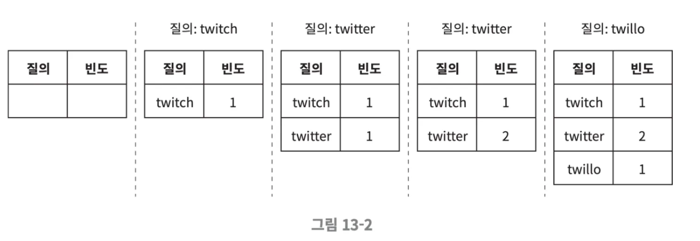

### 질의 서비스

아래와 같은 빈도 테이블이 있는 상태이며, 사용자가 “`tw`”를 검색창에 입력하면 아래의 빈도 테이블에서 빈도수가 높은 5개를 정렬하여 자동완성 검색어가 표시되어야 한다.
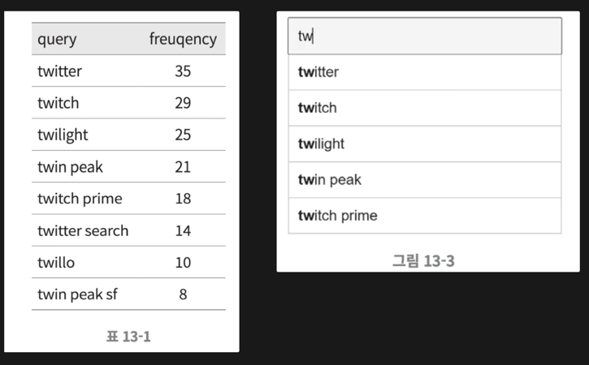
가장 많이 사용된 5개 검색어는 아래의 SQL 질의문을 사용해 계산할 수 있다.

```sql
SELECT * FROM frequency_table
WHERE query Like `prefix%`
ORDER BY frequency DESC
LIMIT 5;
```

→ 데이터 양이 적을 때는 나쁘지 않은 설계

→ 데이터가 많아진다면 **데이터베이스 병목**이 될 수 있음.

# 3단계 - 상세 설계

개략적 설계안보다 상세히 설계하고 다음 순서로 최적화 방안을 논의해볼 수 있다.

- 트라이(trie) 자료구조
- 데이터 수집 서비스
- 질의 서비스
- 규모 확장이 가능한 저장소
- 트라이 연산

### 트라이 자료구조

개략적 설계안에서는 관계형 데이터베이스를 저장소로 사용 → 효율적이지 않다.

**⇒ 트라이를 사용하여 해결할 수 있다.**

그렇다면, `트라이(tire)`는 뭔데 ?

> 문자열 저장. 탐색속도 매우 빠름. O(N)
문자열을 간략하게 저장하고, 문자열을 꺼내는 연산에 초점이 맞춰져있다.
> 

- 트리 형태의 자료구조
- 루트 노드는 빈 문자열을 나타냄
- 각 노드는 글자 하나를 저장하며 26개의 자식 노드를 가질 수 있음
- 각 트리 노드는 하나의 단어, 또는 접두어 문자열을 나타냄

아래는 `tree`, `try`, `true`, `toy`, `wish`, `win` 가 보관된 트라이

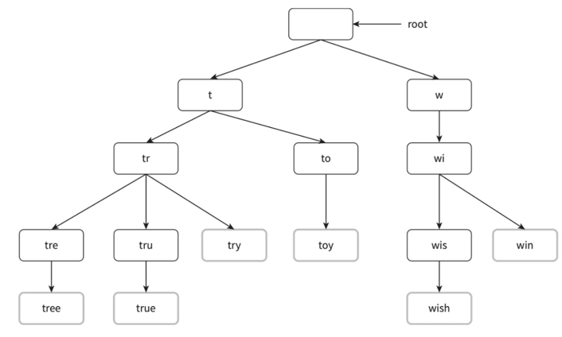

빈도에 따라 정렬된 결과를 내놓기 위해 트라이에 빈도 정보도 저장해야 한다.

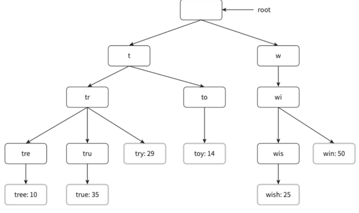

해당 트라이로 검색어 자동완성을 어떻게 구현할 수 있을까?

- p: 접두어(prefix)의 길이
- n: 트라이 안에 있는 노드 개수
- c: 주어진 노드의 자식 노드 개수

가장 많이 사용된 질의어 k개는 다음과 같이 찾을 수 있다.

- 해당 접두어를 표현하는 노드를 찾는다. 시간복잡도 O(p)
- 해당 노드부터 시작하는 하위 트리를 탐색하여 모든 유효 노드를 찾는다. 시간복잡도 O(c)
- 유효 노드들을 정렬하여 가장 인기 있는 검색어 k개를 찾는다. 시간복잡도 O(clogc)

전체 알고리즘 복잡도 = **O(p) + O(c) + O(clogc)**

예제) k=2이고, 사용자가 검색창에 “be”를 입력한 경우

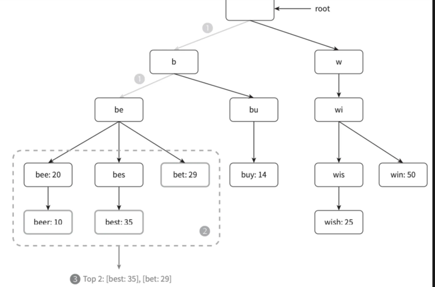

1. 접두어 노드 `be`를 찾는다.
2. 해당 노드부터 시작하는 하위 트리를 탐색하여 모든 유효 노드를 찾는다.[beer: 10], [best: 35], [bet: 29]가 유효 노드
3. 유효 노드를 정렬하여 2개만 골라낸다. [best: 35], [bet: 29]

→ 최악의 경우 **전체 트라이를 다 검색해야 하는 일**이 생길 수도 있다.

⇒ 따라서, 전체 트라이를 다 검색하지 않기 위한 2가지 방법을 숙지하면 좋다.

- 접두어의 최대 길이를 제한
- 각 노드에 인기 검색어를 캐시

### 접두어 최대 길이 제한

사용자가 검색창에 긴 검색어를 입력하는 일은 거의 없음.

따라서 p값은 작은 정숫값이라고 가정해도 안전하다.

→ “접두어 노드를 찾는” 시간복잡도는 O(p)에서 O(작은 상숫값) = O(1)로 바뀔 것이다.

### 노드에 인기 검색어 캐시

각 노드에 k개의 인기 검색어를 저장해 두면 전체 트라이를 검색하는 일을 방지할 수 있음. 시간복잡도 O(1)

❗️ 각 노드에 질의어를 저장할 공간이 많이 필요하게 된다는 단점이 있다.

빠른 응답속도가 아주 중요할 때는 희생할 만한 가치는 있다.

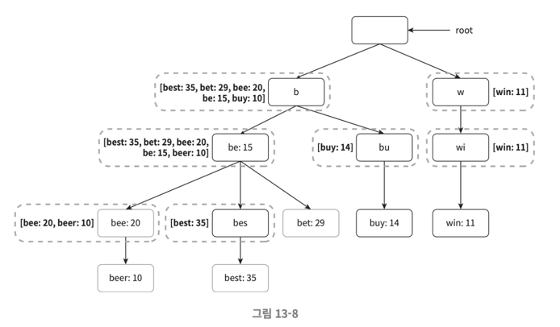

1. 접두어 노드를 찾는 시간 복잡도는 O(1)로 바뀜
2. 최고 인기 검색어 5개를 찾는 질의의 시간 복잡도도 O(1)로 바뀐다.
검색 결과가 이미 캐시되어 있어서다.

각 단계의 시간 복잡도가 O(1)로 바뀐 덕분에 최고 인기 검색어 k개를 찾는 전체 알고리즘의 복잡도는 **O(1)**로 바뀌게 된다.

### 데이터 수집 서비스

지금까지의 설계안은 사용자가 검색창에 뭔가 타이핑을 할 때마다 실시간으로 데이터를 수정했다.

- 매일 수천만 건의 질의가 입력될 텐데 **그때마다 트라이를 갱신하면 질의 서비스는 심각하게 느려질 것**이다.
- 일단 트라이가 만들어지고 나면 **인기 검색어는 그다지 자주 바뀌지 않을 것**.

트위터같은 실시간 애플리케이션이라면 항상 신선하게 유지할 필요가 있지만

구글 검색 같은 애플리케이션은 그렇게 자주 바꿔줄 이유는 없다.

→ 용례에 따라 서비스를 설계하면 된다.

아래는 수정된 데이터 분석 서비스의 설계안.

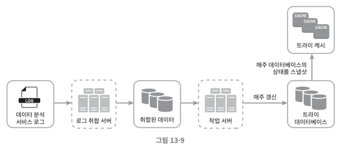

### 데이터 분석 서비스 로그

검색창에 입력된 질의에 관한 원본 데이터가 보관.

데이터가 추가될 뿐 수정은 이루워지지 않으며 로그 데이터에는 인덱스를 걸지 않는다.

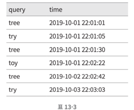

### 로그 취합 서버

트위터와 같은 실시간 애플리케이션 → 데이터 취합 주기를 짧게 가져가는 것이 좋음

대부분의 경우 → **일주일에 한 번 정도로 로그를 취합해도 충분.**

### 취합된 데이터

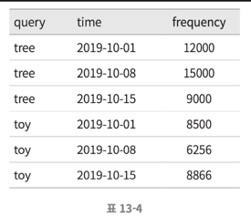

### 작업 서버

작업 서버(worker)는 주기적으로 비동기적 작업(job)을 실행하는 서버 집합.

**트라이 자료구조를 만들고 트라이 데이터베이스에 저장**하는 역할을 담당

### 트라이 캐시

분산 캐시 시스템으로 트라이 데이터를 메모리에 유지하여 읽기 연산 성능을 높이는 구실을 한다.

매주 트라이 데이터베이스의 스냅샷을 떠서 갱신한다.

### 트라이 데이터베이스

트라이 데이터베이스는 지속성 저장소.

트라이 데이터베이스로 사용할 수 있는 선택지로는 2가지가 있다.

1. 문서 저장소(document store)
    - 새 트라이를 매주 만들 것이므로 주기적으로 트라이를 직렬화하여 데이터베이스에 저장할 수 있음
    - 몽고디비 같은 문서 저장소를 활용하면 이런 데이터를 편리하게 저장할 수 있다.
2. 키-값 저장소
- 각 트라이는 아래 로직을 적용하면 해시 테이블 형태로 변환 가능
- 트라이에 보관된 모든 접두어를 해시 테이블 키로 변환
- 각 트라이 노드에 보관된 모든 데이터를 해시 테이블 값을 변환
    
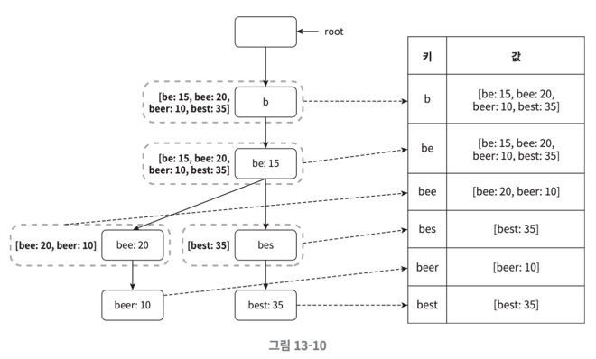
    

### 질의 서비스

지금까지 설명한 설계안은 다음과 같다.
(출처 : 저의 노션에 정리한 글)

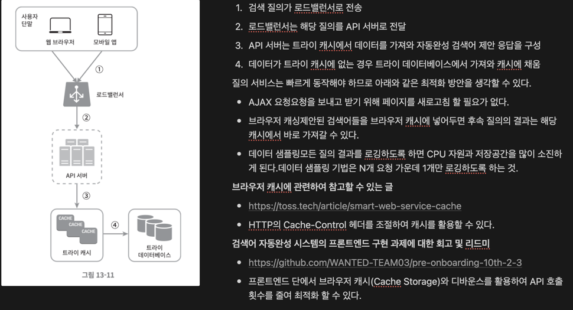

1. 검색 질의가 로드밸런서로 전송
2. 로드밸런서는 해당 질의를 API 서버로 전달
3. API 서버는 트라이 캐시에서 데이터를 가져와 자동완성 검색어 제안 응답을 구성
4. 데이터가 트라이 캐시에 없는 경우 트라이 데이터베이스에서 가져와 캐시에 채움

질의 서비스는 빠르게 동작해야 하므로 아래와 같은 최적화 방안을 생각할 수 있다.

- AJAX 요청요청을 보내고 받기 위해 페이지를 새로고침 할 필요가 없다.
- 브라우저 캐싱제안된 검색어들을 브라우저 캐시에 넣어두면 후속 질의의 결과는 해당 캐시에서 바로 가져갈 수 있다.
- 데이터 샘플링모든 질의 결과를 로깅하도록 하면 CPU 자원과 저장공간을 많이 소진하게 된다.데이터 샘플링 기법은 N개 요청 가운데 1개만 로깅하도록 하는 것.

**브라우저 캐시에 관련하여 참고할 수 있는 글**

- https://toss.tech/article/smart-web-service-cache
- HTTP의 Cache-Control 헤더를 조절하여 캐시를 활용할 수 있다.

**검색어 자동완성 시스템의 프론트엔드 구현 과제에 대한 회고 및 리드미**

- https://github.com/WANTED-TEAM03/pre-onboarding-10th-2-3
- 프론트엔드 단에서 브라우저 캐시(Cache Storage)와 디바운스를 활용하여 API 호출 횟수를 줄여 최적화 할 수 있다.

### 트라이 연산

트라이는 검색어 자동완성 시스템의 핵심 컴포넌트다 !!!
트라이 관련 연산들이 어떻게 동작하는지 확인해보자.

**트라이 생성**

작업 서버가 담당하며, 로그나 데이터베이스로부터 취합된 데이터를 이용하여 트라이를 생성한다.

**트라이 갱신**

- **매주 한 번 갱신하**는 방법→ 새로운 트라이를 만든 다음 기존 트라이를 대체한다.
- 트라이의 **각 노드를 개별적으로 갱신**하는 방법→ 성능이 좋지 않다. (노드를 갱신할 때 모든 상위 노드도 갱신해야 하는데, 노드에 캐시도 보관되기 때문에..)→ 트라이가 작을때는 고려해봄직한 방안.

**검색어 삭제**

혐오성, 폭력적 등.. 여러 가지로 위험한 질의어를 **자동완성 결과에서 제거**해야 한다.

트라이 캐시 앞에 필터 계층을 두고 부적절한 질의어가 반환되지 않도록 할 수 있음.

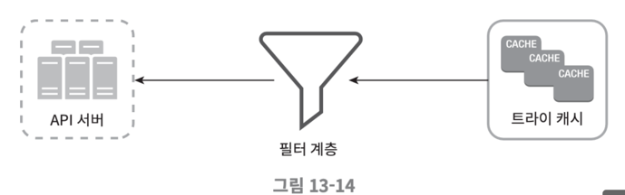

### 저장소 규모 확장

트라이의 크기가 한 서버에 넣기엔 너무 큰 경우 대응할 수 있도록 규모 확장성 문제를 해결해보자

영어만 지원하면 되기 때문에, 간단하게는 첫 글자 기준으로 샤딩하는 방법을 생각해 볼 수 있음.

- **두 대의 서버가 필요한 경우**‘a’부터 ‘m’까지로 시작하는 검색어는 첫 번째 서버에, 나머지는 두 번째 서버에 저장한다.
- **세 대의 서버가 필요한 경우**‘a’부터 ‘i’까지는 첫 번째 서버에, ‘j’부터 ‘r’까지는 두 번째 서버에, 나머지는 세 번째 서버에 저장한다.

이 방법을 쓰는 경우에는 사용 가능한 서버는 최대 26개로 제한. 이 이상으로 서버 대수를 늘리려면 샤딩을 계층적으로 해야 한다.

- **‘a’로 시작하는 검색어를 네 대의 서버에 나눠서 보관하고 싶다면…**`‘aa’~’ag’`, `‘ah’~’an’`, `‘ao’~’au’`, `나머지`로 4개의 서버로 나누어 보관하면 된다.

❗️’c’로 시작하는 단어가 ‘x’로 시작하는 단어보다 많다는 것을 감안하면 좋은 방법은 아님.

→  과거 질의 데이터의 패턴을 분석하여 샤딩하는 방법을 사용한다.

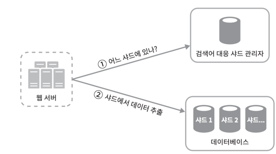

**검색어 대응 샤드 관리자**는 어떤 검색어가 어느 저장소 서버에 저장되는지에 대한 정보를 관리

‘s’로 시작하는 검색어의 양이 ‘u’, ‘v’, ‘w’, ‘x’, ‘y’, ‘z’로 시작하는 검색어를 전부 합친 것과 비슷하다면

`’s’`에 대한 샤드 하나와 `‘u’~’z’`까지의 검색어를 위한 샤드 하나를 두어도 충분할 것.

> 결국 “샤딩”을 추천한다.
> 

도메인 검색을 해보고 싶다라고 하면,

1. rdb Like 한계점 명확해요.
2. 쿼리 튜닝 → 노가다긴 하지만 가능함. → 개발자 투입인데 돈이 드는건데
3. 몽고 db, Es