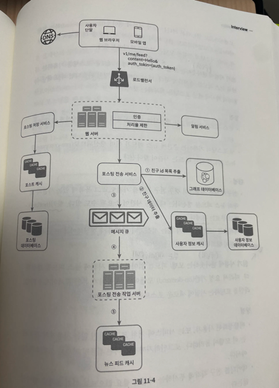
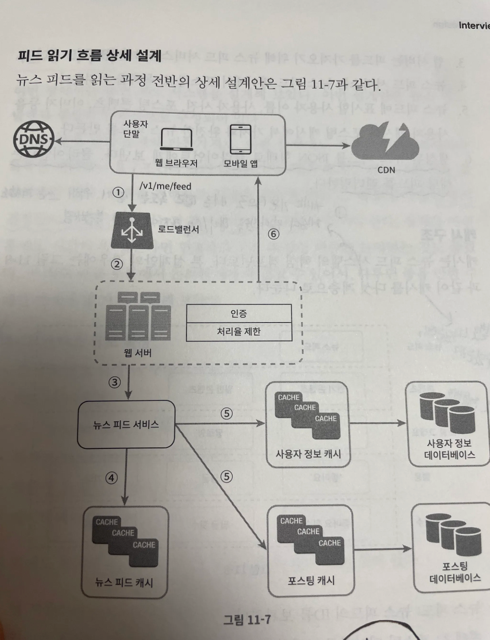
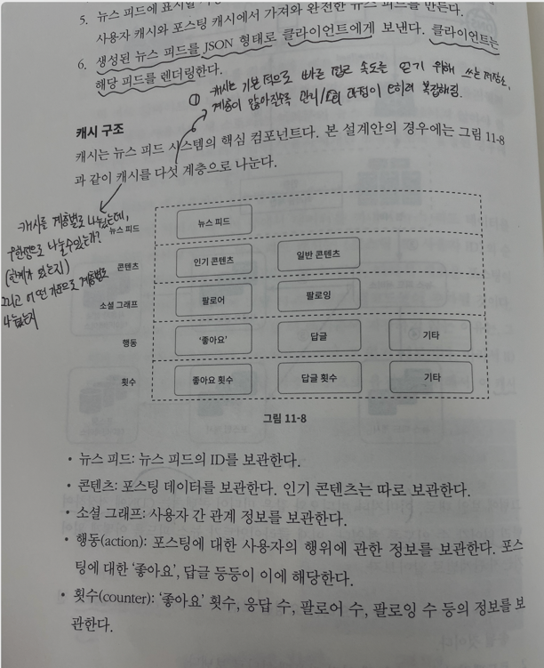
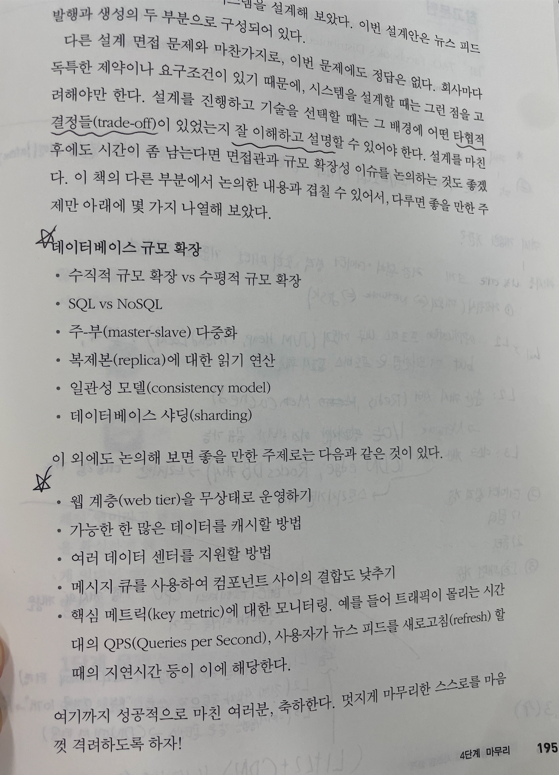
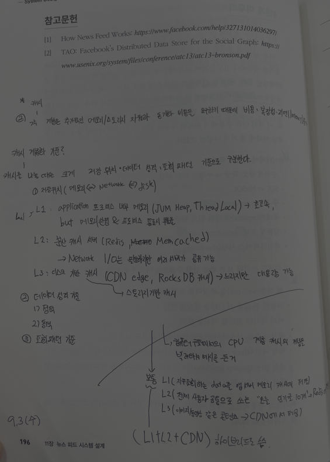

### 뉴스피드란 ?

지속적으로 업데이트되는 것

 

1. 앱이냐 웹이냐. ?
2. 중요한 기능들이 뭐가 있는지
3. 정렬이 되야하는지 ?
4. 최대 트래픽? 
5. 비디오 ? 요런 것들도 올라올 수 잇는지 ?

## 피드 발행 흐름 상세 설계

다시 한 번 아키텍처를 그려야함.

push랑 pull은 피드 생성 설계 방법.

⇒ 정리 한 번 더. 

## 피드 읽기 흐름 상세 설계

## 캐시 ?

### 캐시 구조 ? 계층별 ?

