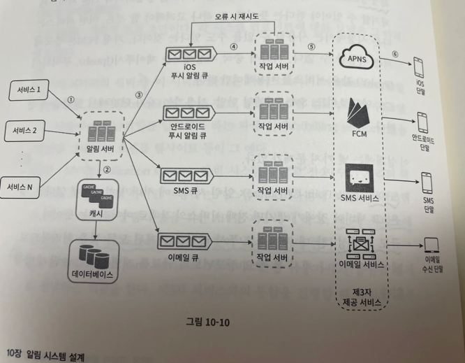
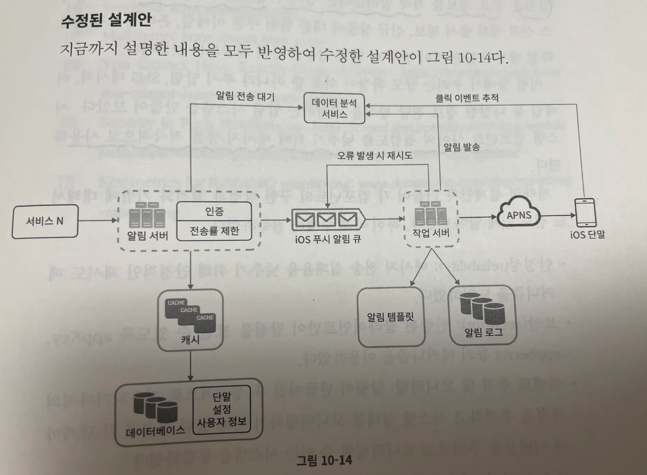

알림 시스템은 고객에게 중요할 만한 정보를 비동기적으로 제공한다.

알림 시스템은 단순히 모바일 푸시 알림에 한정되지않는다.

### ios 푸시 알림

세 가지 컴포넌트가 필요하다.

1. 알림 제공자
- 단말 토큰
- 페이로드
2. APNS
3. ios 단말기

### SMS 메시지

트윌리오, 넥스모 같은 제 3 사업자의 서비스를 많이 이용한다.

### 이메일

센드그리드, 메일침프 등이 있다. 

전송 성공률도 높고, 데이터 분석 서비스도 제공한다.

### 연락처 정보 수집 절차

알림은 모든 단말에 전송되어야 한다는 점을 고려하여, User (1) :  device (N) 

### 알림 전송 및 수신 절차

개략적 설계안

1. 1부터 N까지의 서비스
2. 알림 시스템
제3자 서비스에 전달할 알림 페이로드를 만들어 낼 수 있어야 한다.
3. 제3자 서비스
유의할 것은 확장성

이 설계엔 문제점이 있다.

1. SPOF
2. 규모 확장성
3. 성능 병목

개략적 설계안 (개선된 버전)

1. db와 cache를 알림 시스템의 주 서비스에서 분리
2. 알림 서버를 증설하고 자동으로 수평적 규모 확장이 이뤄질 수 있도록
3. 메시지 큐를 이용해 시스템 컴포넌트 사이의 강한 결합을 끊는다.

### 안정성

분산 환경에서 운영될 알림 시스템을 설계할 때는 안정성을 확보하기 위한 사항 몇 가지를 반드시 고려해야한다.

1. 데이터 손실 방지
2. 알림 중복 전송 방지 

**<i>→ key 캐시로 남겨서 확인하는 방법 ? → 캐시.</i>**

### 추가로 필요한 컴포넌트 및 고려사항

1. 알림 템플릿 활용
2. 알림 설정
3. 전송률 제한
- 알림의 빈도를 제한
4. 재시도 방법
5. 푸시 알림과 보안
6. 큐 모니터링
7. 이벤트 추적

### 수정된 설계안

