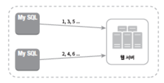
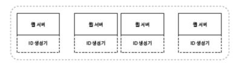
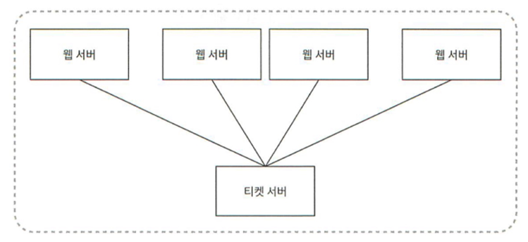
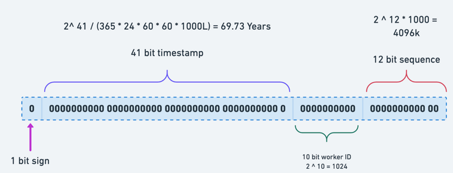
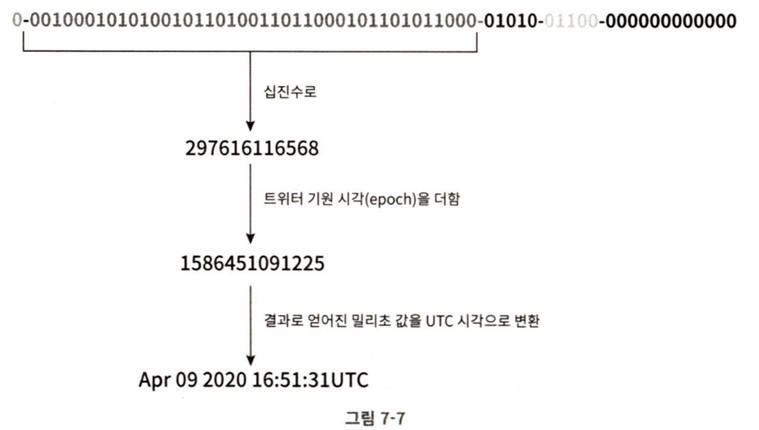

# 개요
auto_increment속성이 설정된 관계형 데이터베이스의 기본 키를 쓰는 방법이 있겠다. 하지만 분산환경에서 데이터베이스 서버 한 대로는 이 요청을 감당할 수 없을 것이고, 여러 데이터베이스를 쓰는 경우 서버들이 중복된 값을 반환하면 안되기에 이를 관리해줘야할텐데 이 때문에 지연시간을 낮추기가 어려울 것이다.

# ✏️ 1단계 문제 이해 및 설계 범위 확정
어떤 문제를 풀던 적절한 질문을 통해 모호함을 없애 설계 하며 풀어가야 한다.

- ID는 어떤 특성을 가지는가? 유일해야하나?
- ID는 숫자로 구성되어 있는가?
- ID는 최대 몇 비트로 표현되어야하는가?
- ID가 꼭 1씩 증가해야하는가?
- 초당 몇 개의 ID를 만들 수 있는가? 시스템 규모가 얼마나 되는가?

# ✏️ 2단계 개략적 설계안 제시 및 동의 구하기
분산 시스템에서 유일성이 보장되는 ID를 만드는 방법은 여러 가지다.

- 다중 마스터 복제(multi-master replication)
- UUID(Universally Unique Identifier)
- 티켓 서버(ticket server)
- 트위터 스노플레이크(twitter snowflake) 접근법

각각의 동작 원리와 장단점을 살펴봐야 한다.

### 다중 마스터 복제

이 접근법은 데이터베이스의 auto_increment기능을 활용하는 것이다. 하지만 다음 ID를 구할 때 1씩 증가하는것이 아닌 서버의 대수 k만큼 증가시키는 것이다. 서버가 3개라면 서버1은 1,4,7 …이렇게 증가하고 서버2는 2,5,8,… 이런식으로 증가할 것이다.

이렇게 하면 규모 확장성 문제를 어느정도 해결할 수 있다. 데이터베이스 수를 늘리면 초당 생산 가능 ID수도 늘릴 수 있기 때문이다. 하지만 서버가 추가되면 이 id들이 고유할까? 단점이 존재한다.

- 여러 데이터 센터에 걸쳐 규모를 늘리기 어렵다.
- ID 유일성이 보장되겠지만 그 값이 시간 흐름에 맞추어 커지도록 보장할 수는 없다.
- 서버를 추가하거나 삭제할 때도 잘 동작하도록 만들기가 어렵다.

### UUID
UUID는 컴퓨터 시스템에 저장되는 정보를 유일하게 식별하기 위한 128비트짜리의 수다. UUID 값은 충돌 가능성이 극히 낮다. 위키피디아를 인용하면 "중복UUID가 1개 생길확률을 50%로 끌어 올리려면 초당 10억 개의 UUID를 100년 동안 계속해서 만들어야 한다."고 한다.

UUID는 09c93e62-50c4-487q-bfz8n-e05g4687bfs3같은 형태를 띈다.

이 구조에서 웹 서버는 별도의 ID 생성기를 사용해 독립적인 ID를 만들어낸다.

#### 장점

- UUID만드는것이 단순하다. 서버간 조율이 불필요해서 동기화 이슈도 없다.
- 각 서버가 독립적으로 자기가 쓸 ID를 만드는것이기에 규모 확장이 쉽다.
#### 단점

- ID가 128비트로 길다.
- ID를 시간순으로 정렬이 불가능하다.
- ID에 숫자가 아닌 값이 포함될 수 있다.

### 티켓 서버
이 방법은 auto_increment 기능을 갖춘 데이터베이스 서버를 티켓서버로 하고, 중앙 집중형으로 하나만 사용하는 것이다.

#### 장점
- 숫자로만 구성된 ID를 쉽게 만들 수 있다.
- 구현하기 쉽고, 중소 규모 애플리케이션에 적합하다.
#### 단점
- 티켓서버가 단일장애지점(SPOF, Single-Point-of-Failure)이 된다. 결국 이 이슈를 해결하기 위해 티켓 서버를 여러 대 준비하게 되는데, 그렇게 하면 데이터 동기화같은 새로운 문제가 발생한다.

### 트위터 스노플레이크 접근법
지금까지 얘기했던 방법들 모두 문제의 요구사항을 만족하지 못했다.

트위터에서 사용하는 스노플레이크라는 ID 생성 기법은 이번 문제의 요구사항을 만족할 수 있다.

이 방법은 divide and conquer 전략을 사용한다.

생성해야하는 ID를 여러 섹션으로 분할하는 것이다.

snowflake는 ID를 5개의 섹션으로 구분한다.

- sign bit : 1비트, 음수와 양수를 구별하는데 사용
- timestamp : 41비트, 기원 시각(epoch) 이후로 몇 밀리초가 경과했는지를 나타내는 값이다.
- 데이터센터 ID : 5비트, 25=32개의 데이터센터를 지원할 수 있다.
- 서버 ID : 5비트, 데이터 센터 당 32개의 서버를 사용할 수 있다.
- 일련번호(sequence) : 12비트, 각 서버에서는 ID를 생성할 때마다 이 일련번호를 1만큼 증가시킨다. 이 값은 1밀리초가 경과할 때마다 0으로 초기화된다.

---

# 3단계 - 상세 설계
문제의 요구사항을 만족시키기 위해 트위터의 snowflake 기법을 사용해서 상세 설계를 진행해보자.

### 데이터 센터 ID와 서버 ID
이 둘은 시스템이 시작될 때 결정되고, 일반적으로 시스템 운영 중에는 바뀌지 않는다.
데이터 센터 ID나 서버 ID 선택 시 잘못하게 되면 ID 충돌이 발생할 수 있으므로 신중하게 작업.
ID 생성기로 '생성'하는 섹션은 타임스탬프와 일련번호가 되겠다.

### 타임스템프
앞서 살펴본 ID 구조에서 가장 중요한 41비트를 차지하고 있다. 타임스탬프는 시간이 흐름에 따라 점점 큰 값을 갖게 되므로, 결국 아이디는 시간순으로 정렬 가능하게 된다.

이진 표현 형태로부터 UTC 시각을 추출하는 예제

41비트로 표현할 수 있는 타임스탬프의 최댓값은 2^41−1=2199023255551 밀리초이다. (약 69년)

기원시각을 현재랑 가깝게 맞추면 오버플로가 발생하는 시점을 늦춰 놓는 것이 된다.

69년이 지나면 기원 시각을 바꾸거나 ID 체계를 다른 것으로 이전해야한다.

### 일련 번호
일련번호는 12비트 이므로 2^12 = 4096개의 값을 가질 수 있다. 어떤 서버가 같은 밀리초 동안 하나 이상의 ID를 만들어 낸 경우에만 0보다 큰 값을 갖게 된다.

→ 두 개 이상의 일련번호가 동일한 시간에 생성된 경우 0보다 큰 값을 가진다.

---

# 4단계 - 마무리

ID 생성기 구현에 쓰일 수 있는 4가지 전략을 살펴보았다.

- 다중 마스터 복제
- UUID
- 티켓 서버
- 트위터의 snowflake
그리고 이번 문제의 요구사항에 적합한 snowflke를 선택했다.

설계 이후에 추가로 논의할 수 있는 주제들은 다음과 같다.

- 시계 동기화(clock synchronization) : 이번 설계를 진행하면서 우리는 ID 생성 서버들이 전부 같은 시계를 사용한다고 가정하였다. 하지만 이런 가정은 하나의 서버가 여러 코어에서 실행될 경우 유효하지 않을 수 있다. 여러 서버가 물리적으로 독립된 여러 장비에서 실행되는 경우에도 마찬가지다. NTP(Network Time Protocol)는 이 문제를 해결하는 가장 보편적 수단.
- 각 섹션의 길이 최적화 : 예를 들어 동시성이 낮고 수명이 긴 애플리케이션이라면 일련번호 절의 길이를 줄이고 타임스탬프 절의 길이를 늘리는 것이 효과적일 수 있다.
- 고가용성(high availability) : ID 생성기는 필수 불가결(mission critical) 컴포넌트 이므로 아주 높은 가용성을 제공해야 할 것이다.

---

# 📌 최종 정리

## 문제 정의
- 분산 환경에서 **유일하고 충돌 없는 ID 생성** 필요
- 요구사항:
  - 숫자 기반 ID
  - 빠른 생성 속도 (낮은 지연시간)
  - 대규모 시스템에서도 충돌 방지
  - 시간순 정렬 가능성 (비즈니스 요구에 따라 유용)

---

## 고려된 방법

### 1. 다중 마스터 복제 (Multi-Master Replication)
- **원리**: 각 DB 서버가 auto_increment를 `N`씩 건너뛰며 ID 생성
- **장점**: 구현 단순, DB 개수만큼 동시 처리량 증가
- **단점**: 서버 추가/삭제 시 관리 복잡, 글로벌 확장성 한계, 시간순 정렬 불가

### 2. UUID
- **원리**: 128비트 난수 기반 ID
- **장점**: 충돌 가능성 극히 낮음, 서버 간 조율 불필요
- **단점**: 길이가 김, 정렬 불가, 숫자가 아닌 값 포함 가능

### 3. 티켓 서버 (Ticket Server)
- **원리**: 중앙 집중형 DB/서비스가 auto_increment로 ID 발급
- **장점**: 구현 쉽고 중소규모에 적합
- **단점**: 단일 장애 지점(SPOF), 규모 확장 어려움

### 4. 트위터 스노플레이크 (Snowflake)
- **원리**: ID를 비트 단위로 분할 → `Sign + Timestamp + Datacenter ID + Server ID + Sequence`
- **장점**:
  - 시간순 정렬 가능
  - 분산 환경에서도 충돌 최소화
  - 높은 확장성 (데이터센터 × 서버 × 초당 수천 건)
- **단점**: 시계 동기화 문제, 운영 복잡성

---

## 최종 선택을 한다면, **Snowflake**

- ID 구조:
  - Sign bit (1비트)
  - Timestamp (41비트, 약 69년 표현 가능)
  - Datacenter ID (5비트)
  - Server ID (5비트)
  - Sequence (12비트, 1ms 당 4096개 ID 생성)

- 특징:
  - **시간순 정렬 가능**
  - **전 세계 수십억 건 수준의 동시 트래픽 처리 가능**
  - **데이터센터/서버별 독립적 ID 생성**

---

# 📌 느낀점 & 개선 포인트

## 느낀점
- 단순 auto_increment나 UUID로는 **대규모 분산 환경**에서 요구사항을 충족하기 어렵다.  
- Snowflake는 **시간 + 위치 + 시퀀스**를 조합해 효율적으로 문제를 해결한다는 점이 인상적이다.  
- 하지만 "시계 동기화(clock sync)" 문제는 쉽게 간과될 수 있고, 이는 **ID 충돌/역순 문제**로 이어질 수 있다.

## 개선/고려 포인트
1. **시계 동기화**  
   - NTP 기반 동기화 사용  
   - "Clock Drift" 감지 시 ID 발급 중단 or 대기 정책 필요

2. **섹션 길이 최적화**  
   - 서비스 성격에 맞게 `timestamp/sequence` 비트 길이 조정  
   - 예: 높은 동시성 → sequence 확장, 장기 서비스 → timestamp 확장

3. **고가용성 설계**  
   - ID 생성기 자체를 **분산/다중화**하여 SPOF 제거  
   - 여러 노드가 동시에 동작하더라도 중복되지 않도록 서버 ID 관리 체계 필요

4. **운영 편의성**  
   - ID 해석(특정 시간/서버 정보 추출)이 가능하므로, **모니터링·디버깅에 유용**  
   - 다만 노출 시 인프라 구조 유추 가능 → 보안 관점 검토 필요

# 결론
- 분산 환경에서 ID 유일성과 확장성을 보장하기 위해 **Snowflake**가 가장 현실적 대안임.  
- 단, 운영 측면에서 **시계 동기화, 비트 설계 최적화, 고가용성 구성**을 반드시 고려해야 함.  
- "ID 생성기"는 단순 기술 요소가 아니라, **서비스 전체의 안정성과 성능을 좌우하는 핵심 인프라 컴포넌트**임을 확인할 수 있었다.