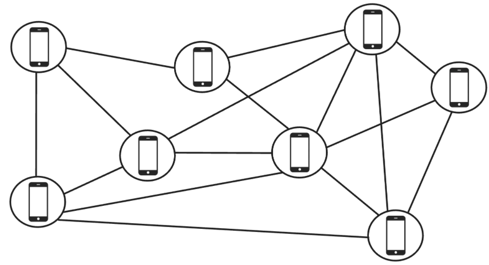

(복선)
- 마지막에 나오는 "점검"이랑 내용이 동일하다.
- 읽기 전에 한 번 확인해보고, 읽고 난 후에 "점검"에서 다시 한 번 점검해보자.<br>는 취지로 작성하였다.
## 1. 위치 정보 정확도 & 인덱싱

단순 위도·경도 비교보다는 지오해시(GeoHash) 기반 인덱싱을 활용하면 성능이 크게 좋아짐.  
→ 친구 1억 명 중 단순 거리 계산은 불가능, GeoHash로 같은 그리드 내 사용자만 필터링 후 거리 계산.  

Redis 자체에도 GEO 관련 명령(GEOADD, GEORADIUS)이 있음.  
→ 캐시 단계에서 바로 반경 내 사용자 검색을 지원할 수 있어 DB 부하를 줄일 수 있음.  


## 2. 데이터 일관성 문제

위치 정보는 결과적 일관성(Eventual Consistency)을 채택했는데, 여기서 고려할 점은 2 가지다.

- **네트워크 지연**: 클라이언트가 30초마다 보낸다고 해도, 실제 친구 앱에 도착할 때는 약간 늦어질 수 있음.  
- **Clock Skew 문제**: 단말 시각이 서버 시각과 다를 수 있음 → 서버 수신 시간을 기준으로 기록하는 전략 필요.  


## 3. 대규모 웹소켓 관리

유상태 서버 확장 시 세션 스티키(Session Affinity) 문제가 발생함.  
→ 같은 사용자가 항상 같은 웹소켓 서버에 붙도록 로드밸런서에서 sticky session 또는 consistent hashing을 적용해야 함.  

서버 장애 시 세션이 끊기는 문제 → Failover 전략 필요 (재연결시 이전 상태를 복구할 수 있도록 Redis 캐시에 저장).  


## 4. 메시지 폭발(팬아웃, Fan-out) 최적화

한 사용자가 위치를 바꿀 때 친구 수 × 서버 수 만큼 이벤트가 발생하는 "팬아웃 폭발" 가능성 있음.  

최적화 방법 ?

- 근처 친구만 필터링 후 발행 (지오해시 기반).  
- 배치 전송(Batching): 짧은 시간 동안 여러 이벤트를 묶어서 전송.  
- 샘플링(Sampling): 위치가 크게 바뀌지 않은 경우 전송하지 않음(이동거리 threshold 설정).  


## 5. 장애 대응 & 운영

Redis Pub/Sub은 메시지를 지속(persistent) 하지 않음 → 서버 다운 시 손실 가능.  
→ 중요한 경우 Kafka 같은 영속 메시지 큐로 보강하는 아키텍처 고려 필요.  

웹소켓 서버/Redis 서버의 헬스 체크 & 자동 재구성이 중요.  
→ etcd/Consul/Zookeeper 기반의 서비스 디스커버리 연계.  


## 6. 보안 및 프라이버시

위치 정보는 민감 데이터 → 전송 시 TLS 암호화 필수.  

저장소(DB, 캐시)에는 TTL을 강하게 적용해서 오래 남지 않도록 관리.  

접근 제어: 친구가 아닌 사용자가 특정 ID를 구독하지 못하게 권한 검증 로직 필요.  


## 7. 실무에서 추가적으로 고려할 API

- **상태 동기화 API**: 클라이언트가 재접속 시 "내 주변 친구들의 최신 상태"를 한 번에 받아올 수 있는 API.  
- **이동 이벤트 최소화**: 위치 갱신을 30초마다 무조건 보내는 게 아니라, 이동거리 > X m 조건일 때만 전송하도록 최적화.  
  → 네트워크와 서버 부하 감소.  


## 깊게 봐야할 포인트

- GeoHash 기반 근처 탐색 최적화  
- Eventual Consistency + Clock Skew 처리  
- 세션 스티키 및 Failover  
- 팬아웃 최적화 전략  
- Redis Pub/Sub 한계 → Kafka 등 대안  
- 위치 정보 보안/프라이버시  
- 실무용 API 개선(초기화, 최소 이동 거리 기반 갱신)  


<hr>

# 2장 - 주변 친구
앱 사용자 가운데 본인 위치 정보 접근 권한을 허락한 사용자에 한해 인근의 친구 목록을 보여주는 시스템이다.<br/>
근접성 서비스의 경우 사업장 주소는 정적이지만, 주변 친구 위치는 자주 바뀔 수 있다.


# 1. 문제 이해 및 설계 범위 확정
### 기능 요구사항
- 사용자는 모바일 앱에서 주변 친구를 확인할 수 있어야 한다.
- 친구 목록은 몇 초마다 한 번씩 갱신되어야 한다.


### 비기능 요구사항
- 낮은 지연 시간: 주변 친구의 위치 변화가 반영되는 데 너무 오랜 시간이 걸리지 않아야 한다.
- 안정성: 시스템은 전반적으로 안정적이어야 하지만, 때로 몇 개 데이터가 유실되는 것 정도는 용인할 수 있다.
- 결과적 일관성: 위치 데이터를 저장하기 위해 강한 일관성을 지원하는 데이터 저장소를 사용할 필요는 없다. 복제본의 데이터가 원본과 동일하게 변경되기까지 몇 초 정도 걸리는 것은 용인할 수 있다.


### 개략적 규모 추정
- 주변 친구는 5마일(8km) 반경 이내 친구로 정의한다.
- 친구 위치 정보는 30초 주기로 갱신한다.
- 평균적으로 매일 주변 친구 검색 기능을 활용하는 사용자는 1억명으로 가정한다.
- 동시 접속 사용자의 수는 DAU 수의 10%로 가정한다.
- 평균적으로 한 사용자는 400명의 친구를 갖는다고 가정한다.
- 앱은 페이지당 20명의 주변 친구를 표시하고, 사용자의 요청이 있으면 더 많은 주변 친구를 보여 준다.

<br/>

# 2. 개략적 설계안 제시 및 동의 구하기
### 개략적 설계안

#### P2P 통신


- 이론적으로 순수한 P2P 방식으로 해결 가능하다.
- 활성 상태인 근방 모든 친구와 항구적 통신 상태를 유지하면 된다.
- 통신 연결 상태가 좋지 않은 경우도 있고 사용할 수 있는 전력도 충분하지 않아서 실용적이지 않다.

<br/>


#### 공용 백엔드 

- 좀 더 실용적인 설계안이다.
- 백엔드는 다음과 같은 역할을 수행한다.
  - 모든 활성 상태 사용자의 위치 변화 내역을 수신한다.
  - 사용자 위치 변경 내역을 수신할 때마다 해당 사용자의 모든 활성 상태 친구를 찾아서 그 친구들의 단말로 변경 내역을 전달한다.
  - 두 사용자의 사이의 거리가 특정 임계치보다 먼 경우에는 변경 내역을 전송하지 않는다.
- 큰 규모에 적용하기 쉽지 않다.
  - 요구사항에 따르면 초당 334,000번의 위치 정보 갱신을 처리해야 한다.
  - 친구를 포함하면 초당 334,000 * 400 * 10% = 1400만 건의 위치 정보 갱신 요청을 처리해야 한다.
  - 결과적으로 엄청난 양의 갱신 내역을 사용자 단말로 보내야 한다.
 
<br/>

### 설계안
#### 개략적 설계안


> **로드밸런서**

- RESTful API 서버 및 양방향 유상태 웹소켓 서버 앞단에 위치한다.
- 부하를 고르게 분산하기 위해 트래픽을 서버들에 배분한다.

<br/>

> **RESTful API 서버**
#### RESTful API 요청 처리 흐름 


- 무상태 API 서버의 클러스터로서, 통상적인 요청/응답 트래픽을 처리한다.
- 해당 API 계층은 친구를 추가/삭제하거나 사용자 정보를 갱신하는 등의 부가적인 작업을 처리한다.

<br/>

> **웹소켓 서버**

- 친구 위치 정보 변경을 거의 실시간에 가깝게 처리하는 유상태 서버 클러스터이다.
- 각 클라이언트는 그 가운데 한 대와 웹소켓 연결을 지속적으로 유지한다.
  - 검색 반경 내 친구 위치가 변경되면 해당 내역은 이 연결을 통해 클라이언트로 전송된다.
  - 모바일 클라이언트가 시작되면, 온라인 상태인 모든 주변 친구 위치를 해당 클라이언트로 전송한다.
 
<br/>

> **레디스 위치 정보 캐시**

- 레디스는 활성 상태 사용자의 가장 최근 위치 정보를 캐시하는 데 사용한다.
- TTL 기간이 지나면 해당 사용자는 비활성 상태로 바뀌고 그 위치 정보는 캐시에서 삭제된다.
- 캐시에 보관된 정보를 갱신할 때는 TTL도 갱신한다.

<br/>

> **사용자 데이터베이스**

- 사용자 데이터 및 사용자의 친구 관계 정보를 저장한다.
- 관계형 데이터베이스 또는 NoSQL 어느 쪽이든 사용 가능하다.

<br/>

> **위치 이동 이력 데이터베이스**

- 사용자의 위치 변동 이력을 보관한다.
- 주변 친구 표시와 직접 관계된 기능은 아니다.

<br/>

> **레디스 펍/섭 서버**
#### 레디스 펍/섭 


- 레디스 펍/섭은 초경량 메시지 버스로, 새로운 채널을 생성하는 것은 아주 값싼 연산이다.
- 웹소켓 서버를 통해 수신한 특정 사용자의 위치 정보 변경 이벤트는 해당 사용자에게 배정된 펍/섭 채널에 발행한다.
- 특정 사용자의 위치가 바뀌면 해당 사용자의 모든 친구의 웹소켓 연결 핸들러가 호출된다.
- 각 핸들러는 위치 변경 이벤트를 수신할 친구가 활성 상태면 거리를 계산하고, 새로 계산한 거리가 검색 반경 이내면 갱신된 위치와 시각을 웹소켓 연결을 통해 해당 친구의 클라이언트 앱으로 보낸다.

<br/>

> **주기적 위치 갱신**
#### 주기적 위치 갱신


1. 모바일 클라이언트가 위치가 변경된 사실을 로드밸런서에게 전송한다.
2. 로드밸런서는 그 위치 변경 내역을 해당 클라이언트와 웹소켓 서버 사이에 설정된 연결을 통해 웹소켓 서버로 보낸다.
3. 웹소켓 서버는 해당 이벤트를 위치 이동 이력 데이터베이스에 저장한다.
4. 웹소켓 서버는 새 위치를 위치 정보 캐시에 저장한다.
5. 웹소켓 서버는 레디스 펍/섭 서버의 해당 사용자 채널에 새 위치를 발행한다.
6. 레디스 펍/섭 채널에 발생된 새로운 위치 반경 이벤트는 모든 구독자에게 브로드캐스트된다.
7. 메시지를 받은 웹소켓 서버는 새 위치를 보낸 사용자와 메시지를 받은 사용자 사이의 거리를 새로 계산한다.
8. (도식화X) 계산 거리가 검색 반경을 넘지 않는다면, 새 위치 및 해당 위치로의 이동이 발생한 시각을 나타내는 타임스탬프를 해당 구독자의 클라이언트 앱으로 전송하고, 반경 거리를 넘지 않으면 보내지 않는다.

<br/>

#### 친구에게 위치 변경 내역 전송 (사용자1의 친구: 사용자 2,3,4 / 사용자 5의 친구: 사용자 4,6) 
 

1. 사용자 1의 위치가 변경되면 그 변경 내역은 사용자1과의 연결을 유지하고 있는 웹소켓 서버에 전송된다.
2. 해당 변경 내역은 레디스 펍/섭 서버 내의 사용자1 전용 채널로 발행된다.
3. 레디스 펍/섭 서버는 해당 변경 내역을 모든 구독자에게 브로드캐스트한다.
4. 위치 변경 내역을 보낸 사용자와 구독자 사이의 거리(사용자1과 2의 거리)가 검색 반경을 넘지 않을 경우 새로운 위치는 사용자2의 클라이언트로 전송된다.

<br/>

### API 설계
- **웹소켓** : 사용자는 웹소켓 프로토콜을 통해 위치 정보 변경 내역을 전송하고 수신한다.
- **HTTP 요청** : API 서버는 친구를 추가/삭제하거나 사용자 정보를 갱신하는 등의 작업을 처리할 수 있어야 한다.

<br/>

> **[서버 API] 주기적인 위치 정보 갱신**

- 요청: 클라이언트는 위도, 경도, 시각 정보를 전송
- 응답: 없음

<br/>

> **[클라이언트 API] 클라이언트가 갱신된 친구 위치를 수신하는 데 사용할 API**

- 전송되는 데이터: 친구 위치 데이터와 변경된 시각을 나타내는 타임스탬프

<br/>

> **[서버 API] 웹소켓 초기화 API**

- 요청: 클라이언트는 위도, 경도, 시각 정보를 전송
- 응답: 클라이언트는 자기 친구들의 위치 데이터를 수신

<br/>

> **[클라이언트 API] 새 친구 구독 API**

- 요청: 웹소켓 서버는 친구 ID 전송
- 응답: 가장 최근의 위도, 경도, 시각 정보 전송

<br/>

> **[클라이언트 API] 구독 해지 API**

- 요청: 웹 소켓 서버는 친구 ID 전송
- 응답: 없음

<br/>

### 데이터 모델

> **위치 정보 캐시**
#### 위치 정보 캐시
```
|키|값|
|--|--|
|사용자 ID|{위도, 경도, 시각}|
``` 
- 주변 친구 기능을 켠 활성 상태 친구의 가장 최근 위치를 보관한다.
- 위치 정보 저장에 DB를 사용하지 않는 이유는 아래와 같다.
  - 사용자 위치는 하나만 보관하기에 충분한데, 레디스는 읽기 및 쓰기 연산 속도가 엄청나게 빠르므로 해당 목적에 적합하다.
  - 주변 친구 기능이 활용하는 위치 정보에 대해서는 영속성을 보장할 필요가 없다.
 
<br/>

> **위치 이동 이력 데이터베이스**

[user_id, latitude, longitude, timestamp]

- 막대한 쓰기 연산 부하를 감당할 수 있고, 수평적 규모 확장이 가능한 데이터베이스를 필요로 한다.
- 카산드라는 해당 요구에 잘 부합한다.
  - 이력 데이터의 양이 서버 한 대에 보관하기에는 방대하므로 샤딩이 필요하다.
  - 사용자 ID를 기준 삼는 샤딩이 가장 기본이다.
  - 부하를 모든 샤드에 고르게 분산시킬 수 있고, 데이터베이스 운영 관리도 간편하다.
 
<br/>

# 3. 상세 설계
### 중간 구성요소별 규모 확장성
> **API 서버**

- 본 설계안의 API 서버는 무상태 서버이다.
- 해당 서버로 구성된 클러스터의 규모를 CPU 사용률이나 부하, I/O 상태에 따라 자동으로 늘리는 방법은 다양한다.

<br/>

> **웹소켓 서버**

- 유상태 서버이기 때문에, 기존의 모든 연결을 종료한 후에 기존 서버를 제거해야 한다.
- 유상태 서버 클러스터의 규모를 자동으로 확장하려면 좋은 로드밸런서가 있어야 한다.

<br/>

> **클라이언트 초기화**

- 웹소켓 연결이 초기화되면 해당 모바일 단말의 위치 정보를 전송한다.
- 정보를 받은 웹소켓 연결 핸들러는 다음 작업을 수행한다.
  1. 위치 정보 캐시에 보관된 해당 사용자의 위치를 갱신한다.
  2. 해당 위치 정보는 뒤이은 계산 과정에 이용되므로, 연결 핸들러 내의 변수에 저장해둔다.
  3. 사용자 DB를 뒤져 해당 사용자의 모든 친구 정보를 가져온다.
  4. 위치 정보 캐시에 일괄 요청을 보내 모든 친구의 위치를 한번에 가져온다.
  5. 캐시가 돌려준 친구 위치 각각에 대해, 웹소켓 서버는 해당 친구와 사용자 사이의 거리를 계산한다.
  6. 웹소켓 서버는 각 친구의 레디스 서버 펍/섭 채널을 구독한다.
  7. 사용자의 현재 위치를 레디스 펍/섭 서버의 전용 채널을 통해 모든 친구에게 전송한다.
 
<br/>

> **사용자 데이터베이스**

- 2가지 종류의 데이터가 보관된다.
  - 사용자 상세 정보(profile) 데이터
  - 친구 관계 데이터
 
- 사용자 ID를 기준으로 데이터를 샤딩하면 관계형 데이터베이스로도 수평적 규모 확장이 가능하다.
- 사용자 및 친구 데이터는 따로 관리하고, 내부 API를 통해 이용해야 한다.

<br/>

> **위치 정보 캐시**

- TTL은 해당 사용자의 위치 정보가 갱신될 때마다 초기화된다. (최대 메모리 사용량은 일정 한도 아래로 유지)
- 각 사용자의 위치 정보는 서로 독립적인 데이터이므로, 사용자 ID를 기준으로 여러 서버에 샤딩하면 부하 또한 고르게 분배할 수 있다.
- 가용성을 높이려면 각 샤드에 보관하는 위치 정보를 대기 노드에 복제해두면 된다.

<br/>

> **레디스 펍/섭 서버**

- 새 채널은 구독하려는 채널이 없을 때 생성한다.
- 구독자가 없는 채널로 전송되는 메시지는 버려지는데, 그 과정에서 서버에 가해지는 부하는 거의 없다.
- 채널 하나를 유지하기 위해서 구독자 관계를 추적하기 위한 해시 테이블과 연결 리스트가 필요하다.

<br/>

> **얼마나 많은 레디스 펍/섭 서버가 필요한가?**

- 메모리 사용량
  - 필요한 채널의 수: 1억 개(10억 사용자의 10%)
  - 모든 채널을 저장하는 데 필요한 메모리: 200GB(1억 * 20바이트 * 100명의 친구 / 10^9)
    - 한 사용자의 활성화 상태 친구 가운데 100명이 주변 친구 기능을 사용한다고 가정한다.
    - 구독자 한 명을 추적하기 위해 내부 해시 테이블과 연결 리스트에 20바이트 상당의 포인터들을 저장해야 한다고 한다.
   
  - 100GB 메모리를 설치할 수 있는 최신 서버를 사용할 경우, 모든 채널을 보관하는 데 레디스 펍/섭 서버 2대면 된다.
 
- CPU 사용량
  - 전송 위치 정보 업데이트 양: 초당 1400만 건
  - 필요한 레디스 서버의 수: 1400만 / 100,000 = 140대 (서버 한 대로 감당 가능한 구독자의 수는 100,000이라고 가정)
 
- 레디스 펍/섭 서버의 병목은 CPU 사용량이다.
- 본 설계안이 풀어야 하는 문제의 규모를 감당하려면 분산 레디스 펍/섭 클러스터가 필요하다.


<br/>

> **분산 레디스 펍/섭 서버 클러스터**

- 서비스 탐색 컴포넌트로 사용 가능한 소프트웨어 중, etcd, 주키퍼 등이 가장 널리 사용된다.
- 본 설계안은 2가지 기능만을 사용한다.
  - 가용한 서버 목록을 유지하는 기능 및 해당 목록을 갱신하는 데 필요한 UI나 API
  - 클라이언트로 하여금 `값`에 명시된 레디스 펍/섭 서버에서 발생한 변경 내역을 구독할 수 있도록 하는 기능
 
<br/>

#### 안정 해시

 
- `키`에 매달린 `값`에는 활성 상태의 모든 레디스 펍/섭 서버로 구성된 해시 링을 보관한다.
- 메시지를 발행할 채널이나 구독할 채널을 정해야 할 때 이 해시 링을 참조한다.
  - Ex. 채널2는 레디스 펍/섭 서버 1번에서 관리되고 있다.
 
<br/>

#### 메시지를 발행할 레디스 펍/섭 서버의 선정


1. 웹소켓 서버는 해시 링을 참조하여 메시지를 발행할 레디스 펍/섭 서버를 선정한다.
2. 웹소켓 서버는 해당 서버가 관리하는 사용자 채널에 위치 정보 변경 내역을 발행한다.

<br/>

> **레디스 펍/섭 서버 클러스터의 규모 확장 고려사항**

- 레디스 펍/섭 서버 클러스터의 속성은 다음과 같다.
  - 펍/섭 채널에 전송되는 메시지는 메모리나 디스크에 지속적으로 보관되지 않는다.
  - 펍/섭 서버는 채널에 대한 상태 정보를 보관한다.
 
- 레디스 펍/섭 서버 클러스터는 유상태 서버 클러스터로 취급하는 것이 바람직하다.
- 클러스터 크기는 다음과 같이 조정한다.
  - 새로운 링 크기를 계산한다.
  - 해시 링의 키에 매달린 값을 새로운 내용으로 갱신한다.
  - 대시보드를 모니터링한다.
 
<br/>

> **운영 고려사항**

- 펍/섭 서버에 장애가 발생하면 모니터링 소프트웨어는 온콜 엔지니어에게 경보를 발송한다.
- 경보 후 서비스 탐색 컴포넌트의 해시 링 키에 매달린 값을 갱신하여 장애가 발생한 노드를 대기 중인 노드와 교체한다. (구독 관계 재구성)

<br/>

### 친구 추가/삭제
- 친구들의 위치가 변경되는 데서 오는 부하는 각 웹소켓 서버가 나누어 처리하므로 핫스팟의 문제는 발생하지 않을 것이다.
- 많은 친구를 둔 사용자의 채널이 존재하는 펍/섭 서버의 경우에 좀 더 많은 부하를 감당하게 될 수 있다.
  - 클러스터 안에 100대가 넘는 펍/섭 서버가 있고, 헤비 유저들의 채널들이 모든 펍/섭 서버에 분산된다는 점을 감안하면, 그 정도의 부하 증가는 큰 부담을 주지 않을 것이다.
 
<br/>

### 주변의 임의 사용자
- 정보 공유에 동의한 주변 사용자를 무작위로 보여줄 수 있도록 추가하는 경우에는 어떻게 해야할까?
  - 지오해시에 따라 구축된 펍/섭 채널 풀을 둔다.
  - 지오해시 격자로 나눈 다음, 격자마다 채널을 하나씩 만들어 둔다.
  - 해당 격자 내의 모든 사용자는 해당 격자에 할당된 채널을 구독한다.
 
<br/>

### 레디스 펍/섭 외의 대안
- 얼랭은 해당 문제에 유용한 해결책으로 대체할 수 있다.
  - `얼랭`: 고도로 분산된 병령 애플리케이션을 위해 고안된 프로그래밍 언어이자 런타임 환경
  - 생성 비용은 리눅스 프로세스 생성 비용에 비해 엄청나게 저렴하다.
  - 여러 서버로 분산하기도 쉽다.
 
<br/>

# 4. 마무리
- 사용자의 위치 정보 변경 내역을 그 친구에게 효율적으로 전달하는 시스템을 설계했다.
  - 웹소켓: 클라이언트/서버 사이의 실시간 통신을 지원
  - 레디스: 위치 데이터의 빠른 읽기/쓰기 지원
  - 레디스 펍/섭: 한 사용자의 위치 정보 변경 내역을 모든 온라인 친구에게 전달하는 라우팅 계층
 
- 아래 구성요소들의 규모 확장을 알아보았다.
  - RESTful API 서버
  - 웹소켓 서버
  - 데이터 계층
  - 레디스 펍/섭 서버 클러스터
  - 레디스 펍/섭 서버의 대안

<hr>

# 최종 점검

## 1. 위치 정보 정확도 & 인덱싱

단순 위도·경도 비교보다는 지오해시(GeoHash) 기반 인덱싱을 활용하면 성능이 크게 좋아짐.  
→ 친구 1억 명 중 단순 거리 계산은 불가능, GeoHash로 같은 그리드 내 사용자만 필터링 후 거리 계산.  

Redis 자체에도 GEO 관련 명령(GEOADD, GEORADIUS)이 있음.  
→ 캐시 단계에서 바로 반경 내 사용자 검색을 지원할 수 있어 DB 부하를 줄일 수 있음.  


## 2. 데이터 일관성 문제

위치 정보는 결과적 일관성(Eventual Consistency)을 채택했는데, 여기서 고려할 점은 2 가지다.

- **네트워크 지연**: 클라이언트가 30초마다 보낸다고 해도, 실제 친구 앱에 도착할 때는 약간 늦어질 수 있음.  
- **Clock Skew 문제**: 단말 시각이 서버 시각과 다를 수 있음 → 서버 수신 시간을 기준으로 기록하는 전략 필요.  

## 3. 대규모 웹소켓 관리

유상태 서버 확장 시 세션 스티키(Session Affinity) 문제가 발생함.  
→ 같은 사용자가 항상 같은 웹소켓 서버에 붙도록 로드밸런서에서 sticky session 또는 consistent hashing을 적용해야 함.  

서버 장애 시 세션이 끊기는 문제 → Failover 전략 필요 (재연결시 이전 상태를 복구할 수 있도록 Redis 캐시에 저장).  


## 4. 메시지 폭발(팬아웃, Fan-out) 최적화

한 사용자가 위치를 바꿀 때 친구 수 × 서버 수 만큼 이벤트가 발생하는 "팬아웃 폭발" 가능성 있음.  

최적화 방법

- 근처 친구만 필터링 후 발행 (지오해시 기반).  
- 배치 전송(Batching): 짧은 시간 동안 여러 이벤트를 묶어서 전송.  
- 샘플링(Sampling): 위치가 크게 바뀌지 않은 경우 전송하지 않음(이동거리 threshold 설정).  


## 5. 장애 대응 & 운영

Redis Pub/Sub은 메시지를 지속(persistent) 하지 않음 → 서버 다운 시 손실 가능.  
→ 중요한 경우 Kafka 같은 영속 메시지 큐로 보강하는 아키텍처 고려 필요.  

웹소켓 서버/Redis 서버의 헬스 체크 & 자동 재구성이 중요.  
→ etcd/Consul/Zookeeper 기반의 서비스 디스커버리 연계.  


## 6. 보안 및 프라이버시

위치 정보는 민감 데이터 → 전송 시 TLS 암호화 필수.  

저장소(DB, 캐시)에는 TTL을 강하게 적용해서 오래 남지 않도록 관리.  

접근 제어: 친구가 아닌 사용자가 특정 ID를 구독하지 못하게 권한 검증 로직 필요.  


## 7. 실무에서 추가적으로 고려할 API

- **상태 동기화 API**: 클라이언트가 재접속 시 "내 주변 친구들의 최신 상태"를 한 번에 받아올 수 있는 API.  
- **이동 이벤트 최소화**: 위치 갱신을 30초마다 무조건 보내는 게 아니라, 이동거리 > X m 조건일 때만 전송하도록 최적화.  
  → 네트워크와 서버 부하 감소.  

---

## 정리하면, 백엔드 기준으로 꼭 더 알아야 할 포인트는 ?

- GeoHash 기반 근처 탐색 최적화  
- Eventual Consistency + Clock Skew 처리  
- 세션 스티키 및 Failover  
- 팬아웃 최적화 전략  
- Redis Pub/Sub 한계 → Kafka 등 대안  
- 위치 정보 보안/프라이버시  
- 실무용 API 개선(초기화, 최소 이동 거리 기반 갱신)  
